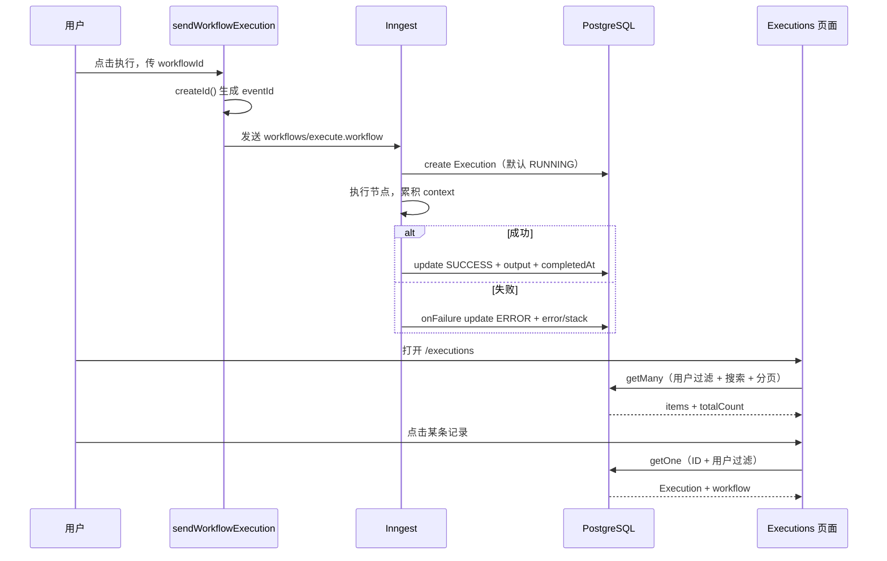

# 029: 执行记录——面向前端初学者的代码级走读与面试指南

提交：`67c59a6 029:执行记录`

对比基准：`5406e74 028:检索失败兜底`

本文不是功能清单，而是一次从数据库到页面的完整代码走读。读者只需要知道 React 组件、`async/await` 和基本 TypeScript；Prisma、tRPC、React Query、Next.js Server Component、nuqs、Inngest 会在第一次出现时解释。

> 路径中原项目使用了 `excutions`、`excution.tsx` 这两个拼写，本文按提交中的真实文件名引用。正确英文应为 `executions`、`execution.tsx`。阅读时不要把它误以为框架约定。

## 1. 最终做成了什么

029 把一次工作流运行从“内存里发生过的一件事”变成数据库中的一条记录：

```text
用户点击执行
  -> 前端/服务端发送 Inngest 事件
  -> Inngest 开始运行，创建 RUNNING 记录
  -> 节点递归执行并不断修改 context
  -> 成功：记录 SUCCESS、completedAt、最终 context
  -> 失败：onFailure 记录 ERROR、错误消息和堆栈
  -> /executions 查询记录列表
  -> /executions/[id] 查询单条详情
```

这里有三种容易混淆的 ID：

| ID | 谁创建 | 用途 |
| --- | --- | --- |
| `workflowId` | 数据库 | 表示执行的是哪一个工作流 |
| `Execution.id` | Prisma 的 `cuid()` | 执行记录详情页和删除接口使用 |
| `inngestEventId` | `createId()` | 把数据库记录与 Inngest 事件关联，失败回调靠它反查记录 |

把三者分开很重要。一份 Workflow 可以运行很多次，所以 `workflowId` 不能唯一标识一次运行；`Execution.id` 是业务记录 ID；`inngestEventId` 是任务平台里的关联 ID。

## 2. 先补齐六个前端概念

### 2.1 Server Component 和 Client Component

Next.js App Router 中，页面文件默认是 Server Component。它在服务端运行，适合鉴权、读取 URL、预取数据，不能使用 `useState`、点击事件等浏览器能力。

文件顶部写了 `"use client"` 后才是 Client Component。列表搜索、删除按钮、折叠错误堆栈都需要浏览器交互，因此对应组件是 Client Component。

本功能的分工是：

```text
page.tsx（服务端）
  负责鉴权、解析 URL、预取、Hydration
        |
        v
ExecutionsList / ExecutionView（客户端）
  负责读取 React Query 缓存、搜索、翻页、删除和折叠
```

### 2.2 tRPC 是什么

tRPC 可以把服务端函数以类型安全的方式提供给前端。这里有三个 procedure：

- `executions.getMany`：查列表；
- `executions.getOne`：查详情；
- `executions.remove`：删除记录。

前端不用手写 `/api/executions?page=1`，而是调用 `trpc.executions.getMany.queryOptions(params)`。输入和输出类型从服务端 Router 自动推导。

### 2.3 React Query 是什么

tRPC 负责“调用哪个服务端函数和类型是什么”，React Query 负责“请求结果如何缓存、加载、失效和重新请求”。

可以把缓存想成一个 `Map`：

```text
['executions', 'getMany', { page: 1, search: '' }] -> 列表数据
['executions', 'getOne',  { id: 'xxx' }]           -> 详情数据
```

删除成功后数据库变了，旧缓存不会自动知道，所以必须 `invalidateQueries`。

### 2.4 Suspense、预取和 Hydration

`useSuspenseQuery` 没数据时会“暂停”组件渲染，让最近的 `<Suspense fallback>` 显示加载界面。若服务端已 `prefetch`，再用 `<HydrateClient>` 把缓存传到浏览器，客户端首屏通常能直接拿到数据。

这三个动作必须成套理解：

```text
服务端 prefetch -> 将结果放进服务端 QueryClient
HydrateClient    -> 序列化并传给浏览器 QueryClient
useSuspenseQuery -> 用相同 query key 命中缓存
```

### 2.5 nuqs 是什么

nuqs 把 URL 查询参数当作 React 状态。例如：

```text
/executions?search=invoice&page=2&pageSize=10
```

这样搜索和页码可刷新、可复制、可前进后退；比只用 `useState` 保存更适合列表页。

### 2.6 Inngest step 是什么

Inngest 是后台任务/工作流执行平台。`step.run("create-execution", callback)` 不只是调用函数，它还给这一步一个稳定名称并持久化步骤结果。任务重放时，已经完成的 step 可以复用结果，减少重复副作用。

## 3. 数据库：一条 Execution 到底存什么

文件：`prisma/schema.prisma`

```prisma
enum ExecutionStatus {
  RUNNING
  SUCCESS
  ERROR
}

model Execution {
  id             String          @id @default(cuid())
  workflowId     String
  workflow       Workflow        @relation(fields: [workflowId], references: [id], onDelete: Cascade)
  status         ExecutionStatus @default(RUNNING)
  error          String?         @db.Text
  createdAt      DateTime        @default(now())
  completedAt    DateTime?
  errorStack     String?         @db.Text
  inngestEventId String?         @unique
  output         Json?           @default("{}")
}
```

逐字段解释：

- `enum ExecutionStatus` 把状态限制为三种值，前后端都能得到同一联合类型，避免出现 `sucess` 一类拼写错误。
- `id @id @default(cuid())` 是执行记录主键，由数据库客户端创建，URL `/executions/[executionId]` 使用它。
- `workflowId` 是真实外键值；`workflow` 是 Prisma 关系字段，不会额外生成一列。
- `fields: [workflowId]` 表示本表用哪个字段做外键；`references: [id]` 表示指向 Workflow 的哪一列。
- `onDelete: Cascade` 表示删除 Workflow 时由数据库自动删除历史执行，避免孤儿数据。
- `status @default(RUNNING)` 让创建记录时不必显式传状态；只有最终成功或失败才更新。
- `error` 保存适合页面展示的短消息；`errorStack` 保存开发排障用的调用栈。两者使用 `Text`，不受普通短字符串长度限制。
- `createdAt @default(now())` 是记录创建时间，在这个实现中近似任务开始时间。
- `completedAt` 在运行中为空；成功或失败时写入。耗时由两者相减得到，不重复保存 duration。
- `inngestEventId @unique` 保证同一个事件最多对应一条 Execution，也允许 `onFailure` 用唯一条件更新。
- `output Json?` 保存最终 workflow context。它是结构不固定的对象，JSON 比为每个节点输出建列更合适。

Workflow 还新增了反向关系：

```prisma
model Workflow {
  // 其他字段省略
  executions Execution[]
}
```

`Execution.workflow` 和 `Workflow.executions` 是同一关系的两端。前者表示“一次执行属于一个工作流”，后者表示“一个工作流有多次执行”。

### 3.1 迁移 SQL 如何对应 Schema

文件：`prisma/migrations/20260710163341_/migration.sql`

```sql
CREATE TYPE "ExecutionStatus" AS ENUM ('RUNNING', 'SUCCESS', 'ERROR');
```

先创建 PostgreSQL 枚举类型，后面的 `status` 列才能引用它。

```sql
CREATE TABLE "Execution" (
  "id" TEXT NOT NULL,
  "workflowId" TEXT NOT NULL,
  "status" "ExecutionStatus" NOT NULL DEFAULT 'RUNNING',
  "error" TEXT,
  "createdAt" TIMESTAMP(3) NOT NULL DEFAULT CURRENT_TIMESTAMP,
  "completedAt" TIMESTAMP(3),
  "errorStack" TEXT,
  "inngestEventId" TEXT,
  "output" JSONB DEFAULT '{}',
  CONSTRAINT "Execution_pkey" PRIMARY KEY ("id")
);
```

Prisma 的 `Json` 在 PostgreSQL 中变成 `JSONB`；`DateTime` 变成毫秒精度时间戳；带 `?` 的字段没有 `NOT NULL`。

```sql
CREATE UNIQUE INDEX "Execution_inngestEventId_key"
ON "Execution"("inngestEventId");
```

它同时承担唯一约束和快速反查。PostgreSQL 允许唯一索引中存在多条 `NULL`，所以 Schema 把字段写成可空后，多条没有事件 ID 的记录理论上仍可存在。

```sql
ALTER TABLE "Execution"
ADD CONSTRAINT "Execution_workflowId_fkey"
FOREIGN KEY ("workflowId") REFERENCES "Workflow"("id")
ON DELETE CASCADE ON UPDATE CASCADE;
```

这才是在数据库层真正建立外键。只写 TypeScript 类型不能保证引用完整性。

## 4. 写入链路：一次执行如何落库

### 4.1 发送事件时主动生成 eventId

文件：`src/app/inngest/utils.ts`

```ts
import { createId } from "@paralleldrive/cuid2";

export const sendWorkflowExecution = async (data: {
  workflowId: string;
  [key: string]: any;
}) => {
  return inngest.send({
    name: "workflows/execute.workflow",
    data,
    eventId: createId(),
  });
};
```

逐行执行：

1. `createId` 在发送前生成一个唯一字符串。
2. 参数要求至少有 `workflowId`；索引签名允许继续携带 `initialData` 等字段。
3. `inngest.send` 把事件提交给 Inngest。
4. `name` 必须和执行函数监听的事件名完全相同。
5. `data` 是业务载荷，执行函数通过 `event.data.workflowId` 读取。
6. `eventId` 是事件自身标识，执行函数通过 `event.id` 得到同一个值。
7. 返回 Promise，让调用方可以等待平台确认接收。

为什么不在执行函数中才生成 ID？因为失败回调拿到的是 Inngest 原事件。如果业务自己生成一个无关 ID，失败回调无法天然关联；直接把发送时的 ID 设成 `eventId`，发送、执行、失败回调三处共享一把关联键。

### 4.2 函数入口先校验两个 ID

文件：`src/app/inngest/functions.ts`

```ts
const workflowId = event.data.workflowId;
const inngestEventId = event.id;

if (!inngestEventId || !workflowId) {
  throw new NonRetriableError("Workflow ID or Event ID is missing");
}
```

- `event.data.workflowId` 来自业务 payload；`event.id` 来自事件 envelope。
- 两者缺任一个都无法建立完整记录，因此立即终止。
- `NonRetriableError` 表示这是数据问题，不是临时网络问题，重试也不会变好。
- 该函数配置了 `retries: 0`，所以当前无论普通错误还是不可重试错误都不会自动重试；这里更多是在表达错误语义。

### 4.3 `create-execution` 创建 RUNNING 记录

```ts
await step.run("create-execution", async () => {
  return prisma.execution.create({
    data: {
      workflowId,
      inngestEventId,
    },
  });
});
```

逐行看：

1. `await` 保证记录创建完成后才继续准备 Workflow。
2. `"create-execution"` 是 Inngest step ID，同一个函数内应保持稳定且唯一。
3. callback 里调用 Prisma `create`，即执行 `INSERT`。
4. 只传两个字段，因为 `id`、`status`、`createdAt`、`output` 都有默认值。
5. 创建后的真实数据大致为：

```json
{
  "id": "数据库生成的 cuid",
  "workflowId": "wf_123",
  "status": "RUNNING",
  "createdAt": "当前时间",
  "completedAt": null,
  "inngestEventId": "发送事件时的 createId",
  "output": {}
}
```

这一步必须在真正执行节点之前，否则节点失败后数据库里根本没有可更新的记录。

### 4.4 节点如何把结果累积进 context

029 没重写整个执行器，但成功时保存的是执行函数最后得到的 `context`。可以把它理解为一个不断被节点扩展的对象：

```text
初始 context = event.data.initialData 或 {}
手动触发器后 = { ...context, manual: ... }
HTTP 节点后   = { ...context, httpResult: ... }
RAG 节点后    = { ...context, ragAnswer: ... }
```

因此 Execution 保存的是“整次工作流最终状态快照”，不是每个节点单独一行日志。节点级实时输出属于 025 的 Realtime 能力，两者职责不同。

### 4.5 成功时更新同一条记录

```ts
await step.run("update-execution", async () => {
  return prisma.execution.update({
    where: {
      inngestEventId,
      workflowId,
    },
    data: {
      status: ExecutionStatus.SUCCESS,
      completedAt: new Date(),
      output: JSON.parse(JSON.stringify(context)),
    },
  });
});
```

逐行解释：

- `update-execution` 只有前面节点全部执行完才会到达，所以代表成功收尾。
- `where` 同时带事件 ID 和工作流 ID。事件 ID 已经唯一，额外带 workflowId 是防御性约束：即使调用者混错 Workflow，也不会更新另一条记录。
- `status` 从默认的 `RUNNING` 变为 `SUCCESS`。
- `new Date()` 记录完成时刻，页面用它减 `createdAt`。
- `JSON.stringify(context)` 把对象转为 JSON 字符串，`JSON.parse` 再转回普通 JSON 值，以满足 Prisma `Json` 输入。

这个 JSON 转换会发生什么：

| 原值 | 转换结果 |
| --- | --- |
| 普通对象、数组、字符串、数字、布尔 | 正常保留 |
| `Date` | ISO 字符串 |
| 值为 `undefined` 的对象属性 | 被删除 |
| `Map`、`Set` | 通常变成空对象 |
| `BigInt` | `JSON.stringify` 抛错 |
| 循环引用 | `JSON.stringify` 抛错 |

所以它不是“任意 JavaScript 值都安全”，更准确的说法是：执行器约定 context 必须是 JSON 可序列化数据。

### 4.6 失败时 `onFailure` 收尾

```ts
onFailure: async ({ event, step }) => {
  return prisma.execution.update({
    where: {
      inngestEventId: event.data.event.id,
    },
    data: {
      status: ExecutionStatus.ERROR,
      error: event.data.error.message,
      errorStack: event.data.error.stack,
      completedAt: new Date(),
    },
  });
},
```

这里的 `event` 不是原始 `workflows/execute.workflow` 事件，而是 Inngest 发给失败处理器的 failure event：

- `event.data.event` 才是原始事件；
- `event.data.event.id` 才是原始 `eventId`；
- `event.data.error` 是函数执行错误。

因此失败回调用原始事件 ID 查找 `create-execution` 创建的那一行，并写入：

```text
RUNNING -> ERROR
error = 给用户/开发者看的 message
errorStack = 完整调用栈
completedAt = 失败结束时间
```

参数中的 `step` 在提交中没有使用，是可以删除的未使用参数。

### 4.7 成功与失败状态机

```text
                    节点全部成功
                 +---------------> SUCCESS
                 |
创建记录 -> RUNNING
                 |
                 +---------------> ERROR
                    任一步抛错，由 onFailure 更新
```

没有 `CANCELLED`、`TIMED_OUT` 等状态，所以产品暂时无法区分用户取消、平台超时和普通错误。

## 5. 读取链路：tRPC Router 逐段讲解

文件：`src/app/features/excutions/server/routers.ts`

### 5.1 Router 的公共入口

```ts
export const executionsRouter = createTRPCRouter({
  getOne: ...,
  remove: ...,
  getMany: ...,
});
```

这只是定义局部 Router。还必须在 `src/trpc/routers/_app.ts` 注册：

```ts
export const appRouter = createTRPCRouter({
  workflows: workflowsRouter,
  credentials: credentialsRouter,
  knowledgeBases: knowledgeBasesRouter,
  executions: executionsRouter,
});
```

对象 key `executions` 决定客户端调用路径是 `trpc.executions.getMany`。导出的 `AppRouter` 类型会让客户端自动知道这三个 procedure。

### 5.2 `getOne`：查详情时同时做权限过滤

```ts
getOne: protectedProcedure
  .input(z.object({ id: z.string() }))
  .query(({ ctx, input }) => {
    return prisma.execution.findUniqueOrThrow({
      where: {
        id: input.id,
        workflow: {
          userId: ctx.auth.user.id,
        },
      },
      include: {
        workflow: {
          select: { id: true, name: true },
        },
      },
    });
  }),
```

逐层拆开：

1. `protectedProcedure` 先保证用户已登录，并让 `ctx.auth.user.id` 可用。
2. `.input(...)` 用 Zod 校验请求必须有字符串 `id`。这是运行时校验，不只是 TypeScript。
3. `.query` 表示只读操作，React Query 可以缓存它。
4. `findUniqueOrThrow` 找不到会抛错，ErrorBoundary 最终显示错误状态。
5. `id: input.id` 定位执行记录。
6. `workflow.userId = 当前用户` 通过关联 Workflow 校验所有权，防止用户猜到 ID 后查看别人记录。
7. `include.workflow.select` 只附带页面需要的工作流 `id/name`，避免把整张 Workflow、节点等都返回。

权限为什么通过 Workflow 判断？Execution 没有重复保存 `userId`，所有权链是：

```text
当前用户 id == Execution.workflow.userId
```

### 5.3 `remove`：删除也必须重复权限校验

```ts
remove: protectedProcedure
  .input(z.object({ id: z.string() }))
  .mutation(({ ctx, input }) => {
    return prisma.execution.delete({
      where: {
        id: input.id,
        workflow: { userId: ctx.auth.user.id },
      },
    });
  }),
```

不能因为页面只显示自己的记录就省掉服务端校验。用户可以绕过 UI 直接发请求；真正安全边界必须在 mutation 内。

`.mutation` 表示它会修改服务端状态。删除成功返回被删记录，前端用返回的 `data.id` 显示 toast。

### 5.4 `getMany` 输入校验

```ts
.input(z.object({
  page: z.number().default(PAGINATION.DEFAULT_PAGE),
  pageSize: z.number()
    .min(PAGINATION.MIN_PAGE_SIZE)
    .max(PAGINATION.MAX_PAGE_SIZE)
    .default(PAGINATION.DEFAULT_PAGE_SIZE),
  search: z.string().default(""),
}))
```

- `page`、`pageSize`、`search` 都有默认值，所以调用方可以传空对象。
- `pageSize` 有上下界，避免一次查询无限多行。
- `page` 在此提交中没有 `.min(1)`，传 `0` 会算出负数 `skip`，这是应修正的输入边界。
- `search` 没有最大长度和 `.trim()`，生产环境可补充。

### 5.5 为什么列表和总数要同时查

```ts
const [items, totalCount] = await Promise.all([
  prisma.execution.findMany(...),
  prisma.execution.count(...),
]);
```

分页组件既需要当前页 `items`，又需要总页数。两个 SQL 互不依赖，用 `Promise.all` 并行能把总等待时间从近似 `A + B` 降到近似 `max(A, B)`。

### 5.6 `findMany` 每个参数如何影响 SQL

```ts
prisma.execution.findMany({
  skip: (page - 1) * pageSize,
  take: pageSize,
  where: {
    AND: [
      { workflow: { userId: ctx.auth.user.id } },
      search
        ? {
            OR: [
              { id: { contains: search, mode: "insensitive" } },
              {
                workflow: {
                  name: { contains: search, mode: "insensitive" },
                },
              },
            ],
          }
        : {},
    ],
  },
  orderBy: { createdAt: "desc" },
  include: {
    workflow: { select: { id: true, name: true } },
  },
})
```

- `skip = (page - 1) * pageSize`：第 1 页跳 0 条，第 2 页跳 `pageSize` 条。
- `take`：只取一页。
- `AND` 第一项永远做租户权限过滤。
- `search ? ... : {}`：没有搜索词时空对象不增加条件。
- `OR` 表示执行 ID 或 Workflow 名任一个包含搜索词即可。
- `mode: "insensitive"` 表示忽略大小写，对工作流英文名有用。
- `orderBy createdAt desc` 让最新执行排在最前面。
- `include` 避免列表为每一行再单独请求 Workflow，规避典型 N+1 请求。

`count` 必须复制完全相同的 `where`。如果 count 忘记搜索或权限条件，页面会显示错误总页数，甚至泄漏别人的记录数量。当前代码正确地复制了过滤条件，但维护时容易两处漂移，最好把 `where` 抽成一个变量复用。

### 5.7 计算分页元数据

```ts
const totalPages = Math.ceil(totalCount / pageSize);
const hasNextPage = page < totalPages;
const hasPreviousPage = page > 1;

return {
  items,
  page,
  pageSize,
  totalCount,
  totalPages,
  hasNextPage,
  hasPreviousPage,
};
```

若共 21 条、每页 10 条，`21 / 10 = 2.1`，向上取整为 3 页。`items` 给列表，其他字段给分页组件或以后扩展“上一页/下一页”。

## 6. URL 状态：搜索和分页为什么刷新不丢

文件：`src/app/features/excutions/params.ts`

```ts
export const executionsParams = {
  search: parseAsString.withDefault("").withOptions({ clearOnDefault: true }),
  page: parseAsInteger
    .withDefault(PAGINATION.DEFAULT_PAGE)
    .withOptions({ clearOnDefault: true }),
  pageSize: parseAsInteger
    .withDefault(PAGINATION.DEFAULT_PAGE_SIZE)
    .withOptions({ clearOnDefault: true }),
};
```

- URL 本质都是字符串，`parseAsInteger` 负责把 `"2"` 解析成数字 `2`。
- `withDefault` 让参数缺失时仍得到完整对象。
- `clearOnDefault` 让第一页默认搜索显示 `/executions`，而不是冗长的 `?search=&page=1&pageSize=10`。

同一份配置被服务端和客户端复用：

```ts
// 客户端：读写浏览器 URL
export const useExecutionsParams = () => useQueryStates(executionsParams);

// 服务端：解析 page.tsx 收到的 searchParams
export const executionsParamsLoader = createLoader(executionsParams);
```

这避免出现“服务端认为 page 是字符串，客户端认为是数字”或默认值不同步。

搜索组件调用 `useEntitySearch` 做本地输入和防抖 URL 更新。完整交互是：

```text
用户键入 -> 本地 searchValue 立刻变化
        -> 防抖结束后 setParams
        -> URL search 改变
        -> query key 改变
        -> getMany 请求新结果
```

搜索词变化时通常还应把 `page` 重置为 1，否则用户在第 8 页搜索后可能落到一个不存在的结果页；是否已经处理取决于通用 `useEntitySearch` 的实现。

## 7. React Query Hooks：客户端如何拿数据和删数据

文件：`src/app/features/excutions/hooks/use-executions.ts`

### 7.1 列表 hook

```ts
export const useSuspenseExecutions = () => {
  const trpc = useTRPC();
  const [params] = useExecutionsParams();
  return useSuspenseQuery(trpc.executions.getMany.queryOptions(params));
};
```

1. `useTRPC()` 取得类型安全的 tRPC 客户端工具。
2. nuqs 返回 `[当前参数, 更新参数函数]`，这里只读第一项。
3. `queryOptions(params)` 生成 query key 和 query function。
4. URL 参数一变，query key 也变，React Query 查询对应页。
5. 数据未准备好时抛给 Suspense，而不是在组件里手写 `if (isLoading)`。

### 7.2 详情 hook

```ts
export const useSuspenseExecution = (id: string) => {
  const trpc = useTRPC();
  return useSuspenseQuery(trpc.executions.getOne.queryOptions({ id }));
};
```

详情页 ID 来自动态路由，作为 query key 的一部分。访问另一条记录会得到另一份缓存，不会互相覆盖。

### 7.3 删除 mutation

提交中的实现：

```ts
export const useRemoveExecution = () => {
  const trpc = useTRPC();
  const queryClient = useQueryClient();

  return useMutation(
    trpc.executions.remove.mutationOptions({
      onSuccess: (data) => {
        toast.success(`Execution "${data.id}" removed`);
        queryClient.invalidateQueries(
          trpc.executions.getMany.queryOptions({}),
        );
        queryClient.invalidateQueries(
          trpc.workflows.getOne.queryFilter({ id: data.id }),
        );
      },
    }),
  );
};
```

逐步执行：

1. `useMutation` 不会在渲染时自动请求，只有 `mutate({ id })` 才执行。
2. 服务端删除成功后进入 `onSuccess`。
3. toast 显示被删 Execution ID。
4. 列表缓存需要失效，否则被删卡片仍留在页面。
5. 第二次失效在提交中写错了：它失效的是 `workflows.getOne`，而且把 Execution ID 当 Workflow ID。

正确意图应是失效 Execution 详情缓存：

```ts
queryClient.invalidateQueries(
  trpc.executions.getOne.queryFilter({ id: data.id }),
);
```

列表失效最好用 `queryFilter()` 匹配所有分页和搜索组合，而不是用空参数的 `queryOptions({})` 只表达一个具体输入。代码审查时应验证 tRPC v11 helper 的匹配语义。

## 8. 列表页：从路由到每一张卡片

### 8.1 服务端页面

文件：`src/app/(dashboard)/(rest)/executions/page.tsx`

```tsx
const Page = async ({ searchParams }: Props) => {
  await requireAuth();
  const params = await executionsParamsLoader(searchParams);
  await prefetchExecutions(params);

  return (
    <HydrateClient>
      <ExecutionsContainer>
        <ErrorBoundary fallback={<ExecutionsError />}>
          <Suspense fallback={<ExecutionsLoading />}>
            <ExecutionsList />
          </Suspense>
        </ErrorBoundary>
      </ExecutionsContainer>
    </HydrateClient>
  );
};
```

执行顺序：

1. Next.js 把 URL 查询参数以 Promise 形式传进来。
2. `requireAuth()` 在服务端阻止未登录访问；tRPC 内仍需再校验，页面鉴权不能代替接口鉴权。
3. loader 把 URL 转成 `{ search, page, pageSize }`。
4. `prefetchExecutions` 在服务端 QueryClient 执行 `getMany`。
5. `HydrateClient` 把预取缓存带到浏览器。
6. `ExecutionsContainer` 放置固定的 Header、Search、Pagination 和内容槽位。
7. 请求错误由 ErrorBoundary 显示；等待数据时由 Suspense 显示 Loading。

`CredentialsList` 在这个文件中被导入但没有使用，应删除。这是从其他列表页复制代码留下的痕迹。

### 8.2 预取 helper 中的类型错误

提交代码：

```ts
type GetManyInput = inferInput<typeof trpc.credentials.getMany>;

export const prefetchExecutions = (params: GetManyInput) => {
  return prefetch(trpc.executions.getMany.queryOptions(params));
};
```

这里错误地从 `credentials.getMany` 推导输入类型。之所以可能没报错，是两个列表输入恰好结构相似，TypeScript 使用结构类型系统：字段形状一样就能赋值。但它让未来某一 Router 改参数后出现隐蔽错误。

应该改为：

```ts
type GetManyInput = inferInput<typeof trpc.executions.getMany>;
```

### 8.3 容器为什么使用组合而不是写死页面

```tsx
<EntityContainer
  header={<ExecutionsHeader />}
  search={<ExecutionsSearch />}
  pagination={<ExecutionsPagination />}
>
  {children}
</EntityContainer>
```

这是组合模式：通用组件负责布局，业务组件负责内容。Workflow、Credential、Execution 列表能保持一致，又不需要复制整套 CSS。

### 8.4 搜索和分页组件

```tsx
export const ExecutionsSearch = () => {
  const [params, setParams] = useExecutionsParams();
  const { searchValue, onSearchChange } = useEntitySearch({ params, setParams });

  return <EntitySearch value={searchValue} onChange={onSearchChange} />;
};
```

`EntitySearch` 是展示组件；`useEntitySearch` 管输入行为；nuqs 管 URL。这种拆分让 UI 不需要知道防抖细节。

```tsx
export const ExecutionsPagination = () => {
  const executions = useSuspenseExecutions();
  const [params, setParams] = useExecutionsParams();

  return (
    <EntityPagination
      disabled={executions.isFetching}
      totalPages={executions.data.totalPages}
      page={executions.data.page}
      onPageChange={(page) => setParams({ ...params, page })}
    />
  );
};
```

- Pagination 自己也读取同一个 query，因此能直接拿服务端计算的总页数。
- 请求下一页时 `isFetching` 为 true，禁用按钮防止连续点击。
- `setParams` 更新 URL，列表 hook 随 query key 变化自动请求。
- `setParams({ ...params, page })` 中展开全部参数通常不是必需的，nuqs 支持只更新 `{ page }`；保留也能表达“不丢搜索词”。

### 8.5 列表如何映射成卡片

```tsx
export const ExecutionsList = () => {
  const executions = useSuspenseExecutions();

  return (
    <EntityList
      items={executions.data.items}
      getKey={(execution) => execution.id}
      renderItem={(execution) => <ExecutionsItem data={execution} />}
      emptyView={<ExecutionsEmpty />}
    />
  );
};
```

这相当于封装后的 `items.map`：`getKey` 给 React 稳定 key；`renderItem` 决定每行长什么样；空数组显示 emptyView。

### 8.6 单项如何计算耗时并删除

```tsx
const duration = data.completedAt
  ? Math.round(
      (new Date(data.completedAt).getTime() -
        new Date(data.createdAt).getTime()) /
        1000,
    )
  : null;
```

`Date.getTime()` 返回毫秒，减法后除以 1000 得秒，`Math.round` 取整。运行中的记录没有 `completedAt`，所以不显示耗时。

```tsx
const removeExecution = useRemoveExecution();
const handleRemove = () => removeExecution.mutate({ id: data.id });
```

Hook 提供 mutation 状态和方法；点击菜单才真正请求。`isPending` 传给 `EntityItem` 后可以禁用重复删除。

```tsx
<EntityItem
  href={`/executions/${data.id}`}
  title={formatStatus(data.status) + "——" + data.id}
  subtitle={subtitle}
  image={getStatusIcon(data.status)}
  onRemove={handleRemove}
  isRemoving={removeExecution.isPending}
/>
```

用户点击主体进入详情，点击菜单删除。状态图标是纯函数映射：SUCCESS 绿色勾、ERROR 红叉、RUNNING 蓝色旋转。

此提交里 `ExecutionsHeader` 和 `ExecutionsEmpty` 初始化了 `useRouter`、`useUpgradeModal`，但没有实际跳转或调用 `handleError`；`ActivityIcon`、`WorkflowsHeader` 等导入也未使用。这些应清理，避免初学者误以为它们参与了流程。

## 9. 详情页：动态路由和展示逻辑

### 9.1 动态参数从哪里来

目录名 `[executionId]` 表示动态路由：

```text
/executions/abc123 -> params.executionId === 'abc123'
```

页面先 `await requireAuth()`，再 `const { executionId } = await params`，最后把 ID 交给 `<ExecutionView executionId={executionId} />`。

### 9.2 这个提交漏掉了详情预取

虽然 `prefetch.ts` 定义了：

```ts
export const prefetchExecution = (id: string) =>
  prefetch(trpc.executions.getOne.queryOptions({ id }));
```

但 `[executionId]/page.tsx` 没有调用它。页面仍能工作，因为客户端 `useSuspenseExecution` 会请求数据；不过 `HydrateClient` 在详情页没有要水合的这条缓存，失去了服务端预取的首屏收益。

应在拿到 ID 后增加：

```ts
await prefetchExecution(executionId);
```

### 9.3 `ExecutionView` 的状态与派生值

```tsx
const { data: execution } = useSuspenseExecution(executionId);
const [showStackTrace, setShowStackTrace] = useState(false);
```

- `execution` 是服务端 `getOne` 的完整返回，包含 `workflow.id/name`。
- `showStackTrace` 只是 UI 展开状态，不需要进 URL 或全局 store。

耗时计算与列表相同。信息区用两列 Grid 展示 Workflow、Status、Started、Completed、Duration、Event ID；Workflow 用 Link 跳回编辑页。

### 9.4 为什么错误堆栈要折叠

```tsx
{execution.errorStack && (
  <Collapsible open={showStackTrace} onOpenChange={setShowStackTrace}>
    <CollapsibleTrigger asChild>...</CollapsibleTrigger>
    <CollapsibleContent>
      <pre>{execution.errorStack}</pre>
    </CollapsibleContent>
  </Collapsible>
)}
```

- 只有存在 stack 才渲染按钮。
- `open` 由 React state 控制，属于受控组件。
- `asChild` 让 Trigger 把交互能力交给内部 Button，避免生成 button 套 button。
- `<pre>` 保留换行和缩进；`overflow-auto` 防止长行撑破页面。

### 9.5 输出为什么用 `JSON.stringify(..., null, 2)`

```tsx
<pre>{JSON.stringify(execution.output, null, 2)}</pre>
```

第二个参数 `null` 表示不做字段替换，第三个参数 `2` 表示两个空格缩进。数据库返回的是对象，JSX 不能直接渲染普通对象，所以先转成可读字符串。

`output` 默认是 `{}`，空对象仍为 truthy，因此一个尚未完成的 RUNNING 记录也会显示空 Output 卡片。若不想显示，应判断状态或 `Object.keys(output).length`。

## 10. 从点击到页面的完整时序



## 11. 必须诚实说明的缺陷和改进

这部分很适合面试，因为它体现的不是“挑自己代码的错”，而是你理解系统边界。

### 11.1 `onFailure` 可能找不到记录

如果错误发生在 `create-execution` 之前，或创建本身失败，`onFailure` 使用 `update` 会因记录不存在再次失败。可改用 `upsert`，或者在发送事件前先创建 Execution，再把 Execution ID 放进事件。

### 11.2 删除 RUNNING 记录会破坏任务收尾

当前 remove 允许删除运行中记录。任务随后执行 `update-execution` 时找不到行，会把本来成功的任务变成失败；失败回调又找不到行。更安全的做法是：

- RUNNING 状态禁删；或
- 实现“取消任务”而不是直接删；或
- 软删除，任务仍能更新内部记录。

### 11.3 状态不会自动刷新

列表/详情通过普通 query 获取数据，没有轮询、Realtime 更新或 `refetchInterval`。用户打开 RUNNING 记录后，它成功了，页面未必立刻变绿。可以在 RUNNING 时轮询，或让 Inngest Realtime 事件更新 Query Cache。

### 11.4 数据库索引不足

常用查询按 `workflow.userId`、`createdAt desc`、`workflowId` 过滤/排序，但迁移只为 `inngestEventId` 建索引。数据量大后应根据 `EXPLAIN ANALYZE` 增加如 `workflowId, createdAt` 的复合索引。`contains` 的任意子串搜索通常也不能使用普通 B-tree，可考虑 trigram/full-text search。

### 11.5 Offset 分页会漂移

当第一页不断插入新 Execution 时，用户翻到第二页可能重复或漏项。大量数据下 `skip` 也越来越慢。历史记录更适合基于 `(createdAt, id)` 的 cursor pagination。

### 11.6 时间语义不够精确

`createdAt` 是数据库记录创建时间，不一定等于用户点击或 Inngest 真正开始处理的时间。若要分析排队耗时，应分别记录 `queuedAt`、`startedAt`、`completedAt`。

### 11.7 没有 Execution 与节点事件的强关联

029 保存最终 output，但没有持久化逐节点 input/output、attempt、duration。Realtime 消息刷新后会丢。生产级审计可增加 `ExecutionStep` 表。

### 11.8 文件命名和小型代码问题

- `excutions` / `excution` 拼写错误，长期会扩散到 import 和团队沟通。
- `prefetchExecutions` 的输入类型错误引用 `credentials.getMany`。
- 删除成功后错误失效 `workflows.getOne`。
- 详情页定义了预取 helper 却没有调用。
- 多处未使用 import、变量和空的新建按钮。
- `page` 缺少 `.min(1)`。
- `output @default("{}")` 与可空 `Json?` 的组合语义含混；若永远有对象，可直接用非空 Json。

## 12. 面试表达：从“会写页面”升级到“懂完整链路”

### 12.1 一分钟回答

> 我给工作流系统补了一套执行历史。任务发送时主动生成 Inngest event ID，后台函数开始后创建默认 RUNNING 的 Execution，成功时持久化最终 context 和完成时间，失败时由 onFailure 通过 event ID 反查并写入错误与堆栈。查询层用 tRPC 和 Prisma 做详情、分页搜索与删除，权限不是只放在页面，而是通过 Execution 关联的 Workflow.userId 在每个查询和 mutation 中过滤。前端把搜索和分页放进 nuqs URL 状态，服务端预取 React Query 数据再 Hydration，客户端用 Suspense 渲染列表和详情。这个版本完成了闭环，但我也识别到详情漏预取、删除缓存失效写错、RUNNING 记录可删除、状态不自动刷新和 offset 分页扩展性等问题。

### 12.2 高频追问与参考回答

#### 为什么要自己生成 `eventId`？

为了建立稳定关联键。Inngest 执行失败后，失败回调拿到原事件 ID；数据库用唯一的 `inngestEventId` 查到对应 Execution。若不保存这把键，只靠 workflowId 无法区分同一 Workflow 的多次执行。

#### 为什么不是执行完后一次性插入记录？

先插入 RUNNING 才能展示正在运行，并且失败时有一行可更新。如果结束后才插入，中途失败可能完全没有历史痕迹。

#### 为什么权限写在 Prisma where，而不是查出来再判断？

把 ID 和所有权放在同一条数据库查询里，未授权数据不会先进入应用内存，代码也更难忘记检查；删除同理。

#### tRPC 和 React Query 分别解决什么？

tRPC 解决接口路由、输入校验和端到端 TypeScript 类型；React Query 解决浏览器缓存、请求状态、失效和重新获取。两者互补，不是同一个东西。

#### 为什么使用 URL 状态而不是 `useState`？

列表搜索和页码是可导航状态。放 URL 后刷新不丢、链接可分享、浏览器前进后退可恢复，也能让 Server Component 在首屏直接知道要预取哪一页。

#### `prefetch + HydrateClient + useSuspenseQuery` 怎么配合？

服务端用与客户端相同 query key 预取；HydrateClient 把缓存序列化到浏览器；useSuspenseQuery 命中缓存后直接渲染，没命中才显示 Suspense fallback 并请求。

#### 为什么 output 用 JSON？

不同 Workflow、节点和 variableName 的输出结构都不同，关系型固定列不适合。JSON 适合保存最终快照；如果以后要按某个输出字段统计或审计每个节点，就应设计专门的 ExecutionStep/指标表，而不是无限依赖 JSON。

#### 如何保证状态更新幂等？

当前靠 `inngestEventId @unique` 和稳定 step ID 降低重复写入，但还不完整。更严谨的方案会用 upsert 创建、带当前状态条件更新，并处理重复 failure/success 事件；同时禁止物理删除运行中记录。

#### 为什么列表会出现 N+1，代码如何避免？

若先查 10 条 Execution，再循环各查一次 Workflow，会有 11 次 SQL。这里用 Prisma `include: { workflow: { select: ... } }` 一次取回关联所需字段。

#### 如果执行量达到百万级怎么改？

使用 cursor pagination；增加 `(workflowId, createdAt, id)` 等索引；把模糊搜索迁到 trigram/全文检索；冷热数据分层；将逐节点记录单独分表；用 Realtime 或按状态轮询更新 RUNNING 记录，并对保留周期做归档策略。

### 12.3 面试官让你现场解释删除代码时

可以按这个顺序回答：

1. 点击卡片菜单调用 `mutate({ id })`。
2. tRPC mutation 先经过 `protectedProcedure`。
3. Zod 验证 ID，Prisma 同时按 ID 和 Workflow owner 删除。
4. 成功结果回到 `onSuccess`，toast 提示。
5. 使列表与详情缓存失效，触发重新获取。
6. 然后主动指出当前提交把详情失效写成了 Workflow，并说明正确 query filter。

这比只说“调用接口删除，然后刷新列表”更能证明你理解真实代码。

## 13. 文件索引：想查某段功能去哪里

| 想理解的内容 | 文件 |
| --- | --- |
| 数据字段、关系和状态枚举 | `prisma/schema.prisma` |
| 数据库真正执行的 DDL | `prisma/migrations/20260710163341_/migration.sql` |
| 事件 ID 如何生成 | `src/app/inngest/utils.ts` |
| RUNNING/SUCCESS/ERROR 如何写入 | `src/app/inngest/functions.ts` |
| 列表、详情、删除和权限 | `src/app/features/excutions/server/routers.ts` |
| URL 参数定义 | `src/app/features/excutions/params.ts` |
| 客户端 URL hook | `src/app/features/excutions/hooks/use-executions-params.ts` |
| React Query hooks | `src/app/features/excutions/hooks/use-executions.ts` |
| 服务端 prefetch | `src/app/features/excutions/server/prefetch.ts` |
| 列表页组件 | `src/app/features/excutions/components/excutions.tsx` |
| 详情页组件 | `src/app/features/excutions/components/excution.tsx` |
| 列表路由 | `src/app/(dashboard)/(rest)/executions/page.tsx` |
| 详情动态路由 | `src/app/(dashboard)/(rest)/executions/[executionId]/page.tsx` |
| 根 Router 注册 | `src/trpc/routers/_app.ts` |

## 14. 读完后应能自己回答的检查题

1. 为什么同一个 Workflow 不能只用 workflowId 标识一次执行？
2. 为什么 `onFailure` 读取的是 `event.data.event.id`，而主函数读取 `event.id`？
3. `createdAt`、`completedAt` 如何算 duration，RUNNING 时为什么是 null？
4. 为什么页面 `requireAuth` 后，tRPC 仍要按 userId 过滤？
5. 搜索参数变化后，React Query 为什么会自动查新数据？
6. 详情页为什么放了 HydrateClient 却仍未真正完成预取？
7. 删除成功后应该失效哪些 query，当前代码错在哪里？
8. 为什么 `JSON.parse(JSON.stringify(context))` 不能处理 BigInt 和循环引用？
9. 为什么不能随便删除 RUNNING 记录？
10. 数据增长后为什么要从 offset pagination 迁到 cursor pagination？

如果能脱离本文把这十题说清楚，就不只是“知道 029 大致做了什么”，而是已经理解这次提交从事件、数据库、API 缓存到页面交互的完整实现。
