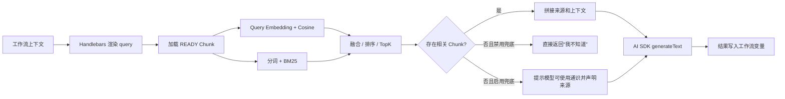

# 030: RAG 设计复盘与面试表达

> 涵盖 024 / 025 / 026 / 028 四个提交。

本文复盘以下四个提交：

| 编号 | Commit | 主题 | 在 RAG 链路中的作用 |
| --- | --- | --- | --- |
| 024 | `6f8ddf0` | RAG 节点和知识库 | 从文件上传、解析、切片、Embedding、检索到生成，完成第一版端到端闭环 |
| 025 | `5d5da82` | 节点输出显示 | 用 Inngest Realtime 展示节点输入、输出和错误，补齐 RAG 调试与可观测性 |
| 026 | `0ce7d1d` | 多路召回策略和不同切片策略 | 从单一递归切片、向量召回升级为按文件类型切片和五种检索模式 |
| 028 | `5406e74` | 检索失败兜底 | 增加弱召回判断、拒答与可选 LLM 通识兜底，控制幻觉、成本和可用性 |

> 说明：当前 Git 历史中没有编号为 027 的提交，026 后直接是 028。本文结论来自提交 diff 和当前代码静态分析，不包含线上流量、标注集或压测数据。性能数字若未特别说明，均是复杂度推断，不是实测结论。

> 2026-07-11 更新：在上述提交之后，Embedding 已由 PostgreSQL `JSONB` 迁移为 pgvector `vector`，向量 TopK 改由数据库执行，并为 768、1024、1536、2048、3072 等常见维度建立 HNSW 索引。下文讨论 024 的 JSON 方案时指的是该提交当时的历史实现。

> 阅读定位：第一至十章是设计复盘；第十一章开始是为前端初学者补写的代码级走读，会解释关键函数的输入、输出、逐步执行和页面影响。第一次接触 RAG，建议先读第十一章，再回看前面的架构与面试总结。

## 一、先说结论

这四次提交的核心价值，不只是“接了一个大模型接口”，而是逐步完成了一个可配置、可观察、有降级策略的工作流 RAG 产品：

1. 024 先打通最小闭环，验证知识入库和工作流问答能够成立。
2. 025 解决黑盒问题，让开发者能看到每个节点的输入、输出和异常。
3. 026 针对真实资料类型和查询类型优化召回，提升员工编号、姓名、表格字段和自然语言问题混合场景下的覆盖率。
4. 028 把“没有可靠知识”变成显式状态，根据产品要求选择拒答或通识回答。

架构上最大的优点是边界比较清楚：知识库负责索引，RAG 节点负责查询编排，工作流负责上下文传递，Realtime 负责执行反馈。向量召回已经迁移到 pgvector，避免了将全量 Embedding 拉进 Node.js；当前主要的扩展性边界转移到了应用层 BM25，它在关键词或混合模式下仍需读取知识库全部 Chunk 正文。

## 二、整体架构

### 2.1 离线索引链路


索引侧涉及三层数据：

- `KnowledgeBase`：归属用户，保存 Embedding provider、model、credential 和切片配置。
- `KnowledgeBaseFile`：记录文件名、MIME、大小、状态、Chunk 数和错误。
- `KnowledgeBaseChunk`：保存正文、pgvector Embedding、metadata 和文件内序号。

数据库级联删除保证知识库或文件删除时同步清理 Chunk；`fileId + chunkIndex` 唯一约束保证文件内 Chunk 顺序唯一。

### 2.2 在线检索与生成链路



RAG 节点把结果放到配置的 `variableName` 下，除答案外还保留：

- 实际使用的 `chunks`；
- 检索阶段返回但未通过相关性判断的 `candidateChunks`；
- `retrievalMode`、融合参数和阈值；
- `retrievalWeak`、`fallbackUsed`；
- 模型 usage、finish reason 和 provider metadata。

这让下游节点既可以只消费答案，也可以基于检索证据和运行状态继续分支。

## 三、逐提交设计复盘

### 3.1 024：先完成端到端 RAG 闭环

#### 解决的问题

在 024 之前，项目已经有工作流和 AI 节点，但模型只能依赖自身知识或上游传入的文本。024 新增知识库管理和 RAG 节点，使用户能上传私有资料并在工作流中检索问答。

#### 关键设计

##### 1. 知识库与工作流节点解耦

知识库作为用户级资源独立维护，RAG 节点只引用 `knowledgeBaseId`。这样一份索引可以被多个工作流复用，避免每个节点重复上传和 Embedding。

同时，Embedding 模型和生成模型是两套配置：

- 知识库绑定 Embedding provider/model/credential，保证文档向量与 query 向量来自同一模型空间。
- RAG 节点绑定回答模型和 credential，可以用便宜的 Embedding 模型配合更强的生成模型。

##### 2. 多格式解析统一成 LangChain Document

解析层支持 PDF、DOCX、XLSX、XLS、CSV、TXT 和 Markdown：

- PDF 使用 `pdf-parse`；
- DOCX 使用 `mammoth`；
- 表格使用 `xlsx`；
- 纯文本直接按 UTF-8 读取；
- 最终统一成 LangChain `Document`，让后续切片只依赖 `pageContent + metadata`。

这是一个合适的适配层设计。具体解析库可以替换，切片和 Embedding 代码不需要跟着改。

##### 3. 首版采用递归字符切片

024 固定使用 `RecursiveCharacterTextSplitter`，默认 `chunkSize=1000`、`chunkOverlap=150`。递归切片优先保留段落、换行等自然边界，比纯固定长度更适合作为通用默认值；15% overlap 用空间和 Embedding 成本换取跨 Chunk 语义连续性。

但这只是通用基线。对于表格，一行员工记录可能与相邻行混在一个 Chunk 中；对编号和专有名词查询，纯语义向量也可能不稳定。这正是 026 要解决的问题。

##### 4. 自己封装 ProviderEmbeddings

项目继承 LangChain `Embeddings` 抽象，但没有把业务锁死在单一厂商 SDK：

- OpenAI-compatible 与 Qwen 走 `/embeddings` 兼容协议；
- Gemini 走 `batchEmbedContents`；
- 返回向量经过结构校验；
- 文档按批请求，首版每批 16 个；
- provider、model 和 base URL 都可配置。

这个选型兼顾了接口统一和国内模型接入。`maxRetries: 0` 配合 Inngest 的失败语义，避免 SDK 内部重试与任务层重试叠加，但当前 RAG 执行本身也是 `retries: 0`，所以网络瞬时错误的恢复能力有限。

##### 5. 首版先用 PostgreSQL JSON 存向量

024 将 Embedding 保存为 Prisma `Json`，查询后在 Node.js 中手写 cosine similarity，排序取 TopK。

这个方案的合理性是：

- 不需要引入 pgvector、Milvus、Qdrant 等额外基础设施；
- 不受向量维度约束，切换供应商更容易；
- Prisma CRUD 简单，适合快速验证产品闭环。

代价是数据库不能使用 ANN 索引，在线检索必须全量读取和计算。它是 024 当时的 MVP 选型；后续已经迁移到 pgvector。

##### 6. Prompt 与工作流上下文可配置

RAG 节点用 Handlebars 渲染 query、system prompt 和 answer prompt，因此可以引用上游变量。默认 Prompt 要求只根据检索上下文回答、不知道就明确拒答，并使用与问题相同的语言。

#### 024 的效果

从功能覆盖看，024 已经具备完整 RAG：数据接入、索引、检索、Prompt augmentation、生成和工作流输出。其效果上限主要受三个因素限制：固定切片策略、纯向量召回，以及没有独立的相关性拒绝层。

### 3.2 025：让 RAG 从黑盒变成可调试系统

025 并没有直接修改召回算法，但对 RAG 落地非常重要。没有可观测性时，用户只看到“答案不对”，无法判断问题来自：

- 上游 query 模板渲染错误；
- 没召回到正确 Chunk；
- Prompt 拼接错误；
- 模型生成偏离上下文；
- 节点本身执行异常。

#### 技术方案

Inngest 执行器在每个节点执行前后发布 `loading / success / error` 事件，事件包含：

- workflow、node、execution 标识；
- 节点输入 context 和 data；
- 节点输出及新增 context；
- 序列化后的错误信息。

前端通过 `useInngestSubscription` 订阅实时消息，以 `nodeId` 保存最新状态。点击 React Flow 节点后，右侧面板按“输出 / 输入 / 错误”三个 Tab 展示 JSON。

#### 前端设计评价

这个交互与工作流编辑器很匹配：用户不离开画布就能定位某个 RAG 节点，查看召回 Chunk、分数、来源、模型 usage 和最终答案。执行开始时清空旧输出，也降低了把上次结果误认为本次结果的概率。

为了避免 Realtime 消息过大，代码对字符串长度、数组/对象元素数和递归深度做了截断。这是必要的保护，但也意味着超长 RAG context 在面板中不是完整原文，排障时要明确这一点。

#### 当前风险

Realtime channel 使用固定的 `node-output` 名称，订阅 token 没有按 workflow 或 user 创建隔离 channel；前端只是在收到消息后按 `workflowId` 过滤。这种“客户端过滤”不能替代服务端租户隔离。生产环境应把 user/workflow/execution 放进 channel 标识或 token 权限范围。

另外，前端状态以 `nodeId` 为唯一 key，没有同时按 `executionId` 分桶。并发执行同一个工作流时，不同执行的消息可能覆盖。更稳妥的结构是 `executionId -> nodeId -> event`，并让本次执行按钮拿到明确的 execution ID。

### 3.3 026：从单路召回升级为按数据类型和查询类型优化

026 的设计思想是：RAG 效果不能只靠换更大的模型，切片和召回策略必须匹配数据结构与查询意图。

#### 切片策略

| 策略 | 实现 | 适用场景 | 主要取舍 |
| --- | --- | --- | --- |
| `AUTO` | 表格自动按行，其他文档递归切片 | 默认配置 | 降低用户理解成本，但文件类型只是粗粒度判断 |
| `RECURSIVE` | LangChain 递归文本切分 | PDF、Word、Markdown、普通长文 | 边界自然，通用性最好 |
| `FIXED_SIZE` | 固定字符窗口 + overlap | 结构规则或快速实验 | 性能直观，但可能截断句子 |
| `LINE_GROUP` | 按行聚合到目标字符数 | 多行段落、解析后的 PDF/Word | 保留行结构，但超长单行仍可能超过目标大小 |
| `SPREADSHEET_ROW` | 一行一个 Chunk，并带表头 | 员工、客户、商品等结构化表格 | 精确定位强；行太短时语义信息可能不足 |

表格按行切片时，内容会被重写为类似 `姓名: 张三\n部门: 研发部` 的键值文本，并保留 sheetName、rowNumber 等 metadata。相比直接将整张表按字符切分，这能显著减少跨记录污染，也让 Embedding 和关键词检索同时看见字段含义。

知识库一旦已有 Chunk，就禁止修改 Embedding provider/model 和切片参数。这个约束避免旧向量、新向量或不同切片规则混在同一个索引里；用户需要删除文件后重新上传，语义上相当于显式 re-index。

#### 关键词召回

026 在应用层实现了一版轻量 BM25：

- 英文、数字、路径、编号等按 token 匹配；
- 连续中文除保留整词外，还生成二元 gram；
- 使用 BM25 的 TF、IDF 和文档长度归一化；
- query 完整子串命中额外加分。

它弥补了向量召回对员工号、订单号、人名、产品型号等精确字符串不稳定的问题。中文二元 gram 不依赖分词词典，部署简单，但会产生较多 token，也无法真正理解中文词边界。

#### 五种检索模式

##### `VECTOR`

只计算 query 与所有 Chunk 向量的 cosine similarity。适合自然语言改写、近义表达和概念型问题。

##### `KEYWORD`

只做 BM25，不调用 query Embedding API。适合编号、姓名和专有名词，也能节省一次外部请求的延迟与费用。

##### `HYBRID_RRF`（默认）

向量和关键词分别排序后，用 Reciprocal Rank Fusion 融合：

```text
RRF(d) = Σ 1 / (k + rank_i(d))
```

默认 `k=60`。RRF 只依赖名次，不要求 cosine 与 BM25 原始分数同分布，因此比直接加权更稳健，适合作为缺少标注数据时的默认方案。

##### `HYBRID_WEIGHTED`

先分别按本次候选中的最大分归一化，再按默认 `0.7 * vector + 0.3 * keyword` 融合。优点是业务可以表达“更信语义还是更信精确词”；缺点是权重和归一化对查询集合敏感，需要离线评测调参。

##### `HYBRID_MERGE`

合并两路结果并按两路归一化分数的最大值排序。它强调“任一路强命中就保留”，召回更宽松，但可能让只在一路偶然高分的结果排得过前。

#### 026 的效果判断

在没有标注集的前提下，不能严谨声称 Recall@K 提升了多少。但从机制上可以预期：

- 表格行切片会减少记录互相污染，提高结构化数据查询的定位精度；
- BM25 会补回向量模型容易漏掉的 exact match；
- 向量召回会补回关键词不一致但语义相近的表达；
- RRF 对两路分数量纲不一致更鲁棒，因此作为默认策略合理。

一个需要注意的语义问题是：`minScore` 在 VECTOR 中是原始 cosine，在 KEYWORD、RRF、weighted 等模式中又可能是归一化分数。不同模式的阈值不可直接横向比较，UI 如果允许用户切换模式，应提示重新校准阈值。

### 3.4 028：区分“检索不到”和“模型不会”

026 提高了召回覆盖率，但系统仍需要回答一个产品问题：如果召回结果很弱，是否还要调用 LLM？

028 引入两个配置：

- `minVectorScore`，默认 `0.4`；
- `allowLlmFallback`，默认关闭。

相关性判断规则是：Chunk 只要关键词分数大于 0，或者向量分数达到阈值，就会进入生成上下文。过滤后没有 Chunk，则 `retrievalWeak=true`。

#### 两种降级路径

##### 默认安全路径：拒答

如果弱召回且未开启 LLM fallback，节点直接返回“我不知道”，不调用生成模型。它同时带来三点收益：

- 降低无证据生成造成的幻觉；
- 少一次 LLM 请求，降低延迟和 token 成本；
- 通过 `finishReason=no_relevant_context` 给下游明确的机器可读状态。

##### 可用性优先路径：通识兜底

如果开启 fallback，模型可以使用通识回答，默认 system prompt 要求明确声明答案并非来自知识库。这适合通用客服或助手，但不适合法务、医疗、内部制度等必须有据可查的场景。

Prompt 只能降低风险，不能保证模型一定披露来源。更严格的实现应返回结构化字段，例如 `answerSource: knowledge_base | general_knowledge | none`，并由 UI 固定渲染警告，而不是完全依赖模型自述。

#### 当前阈值的不足

“任意关键词命中即相关”比较宽松，一个低 IDF 的普通词也可能让 Chunk 通过；`0.4` 也不是对所有 Embedding 模型都通用。更合理的阈值需要按 provider/model、语言、文档类型和检索模式，通过标注集分别校准。

## 四、技术选型分析

### 4.1 Next.js Route Handler + tRPC

- 知识库元数据 CRUD 走 tRPC，获得端到端类型、Zod 校验、React Query 缓存和统一鉴权。
- 文件上传走原生 Route Handler + `FormData`，避免把二进制强塞进 JSON RPC。
- 上传接口显式使用 Node.js runtime，以支持 Buffer 和文档解析库。

分工合理，但当前解析、Embedding 和落库都在上传 HTTP 请求内同步完成。25 MB 文件、多批 Embedding 或供应商抖动时可能碰到请求超时。生产方案应改为“上传对象存储 -> 创建 PROCESSING 记录 -> Inngest 后台索引 -> 前端订阅进度”。

### 4.2 Prisma + PostgreSQL

Prisma 适合业务模型、权限关系和级联删除。024 使用 JSON 是原型阶段的选择；当前 schema 使用 `Unsupported("vector")` 映射 pgvector，通过参数化 Raw SQL 写入和查询，因为 Prisma 6.16.3 不直接提供该字段的类型安全 CRUD。

迁移采用无固定维度的 `vector` 列，以兼容多个 Embedding provider。常见维度通过 partial expression HNSW 索引加速：768、1024、1536 使用 `vector` opclass，2048、3072 使用 `halfvec` opclass；未知维度仍在 PostgreSQL 内执行精确 cosine 排序。

如果未来单库规模继续增长，可在以下方案间选择：

1. 继续使用 PostgreSQL + pgvector：业务数据和向量保持在一个数据库，进一步按模型/维度分区；关键词侧迁移到 PostgreSQL FTS 或专用搜索服务。
2. 独立向量数据库：适合更大规模、复杂 metadata filter 或多租户索引，但增加同步和运维成本。

如果保留 PostgreSQL，Chunk 表至少应记录 embedding model/version 和确定维度，支持可审计的增量 re-index。

### 4.3 LangChain + AI SDK

- LangChain 只承担 `Document`、Text Splitter 和 Embeddings 抽象，使用范围克制。
- AI SDK 负责多厂商语言模型与统一的 `generateText` 返回结构。
- 自定义 Provider adapter 处理国内兼容接口和 base URL。

这个组合避免了把整个工作流执行框架交给某个 RAG 框架，业务控制力较强。缺点是 Embedding 和 Language Model 各有一套 provider factory，长期容易配置漂移，建议抽成统一 provider registry。

### 4.4 Inngest Realtime

Inngest 已经是项目工作流执行引擎，因此复用 Realtime 发布节点状态，比再引入 WebSocket 服务成本低。它解决的是可观测性和用户体验，不直接提升检索质量，却显著缩短调参与排错闭环。

## 五、性能分析

设：

- `N` 为某知识库的 Chunk 数；
- `D` 为 Embedding 维度；
- `L` 为所有 Chunk 的总 token/字符扫描量；
- `K` 为最终 TopK。

### 5.1 索引阶段

| 环节 | 当前行为 | 复杂度或瓶颈 |
| --- | --- | --- |
| 文件读取 | `file.arrayBuffer()` 后整体进内存 | 内存至少包含原文件 Buffer，解析库还可能产生额外副本 |
| 切片 | 按文档或行在 Node.js 处理 | 大致 O(文件字符数) |
| Embedding | 每批 10 个，批次串行 | 主要受外部 API 延迟、限流和批大小影响 |
| 落库 | 每批一次 `createMany` | 比逐 Chunk insert 好，但不是全流程事务 |

026 将批大小从 16 调为 10，通常更兼容供应商单请求限制，但在相同限流条件下可能增加批次数和总往返延迟。这是稳定性与吞吐量的交换，是否值得需要实测不同 provider。

当前先删除该文件旧 Chunk，再逐批生成和写入。若中途失败，可能留下部分新 Chunk；文件会标记 ERROR，在线检索只查 READY 文件，因此错误文件不会参与查询，但再次处理和数据清理仍应设计幂等策略。

### 5.2 在线检索阶段

向量检索现在由 PostgreSQL 完成 cosine distance 排序，只把候选 Chunk 返回应用层：

- 常见维度可以命中 HNSW partial expression index；
- 未配置索引的维度仍由 PostgreSQL 精确扫描，但不再把全量向量传给 Node.js；
- 纯 VECTOR 模式只返回 `max(K*8, 40)` 个向量候选；
- BM25 分词和计分仍约为 O(L)；
- KEYWORD 和混合模式仍会读取全部 Chunk 正文，应用内存约为 O(L)。

RRF、merge 和 weighted 现在融合数据库返回的向量候选与应用层关键词结果。向量侧已经提前截断；关键词侧仍是当前主要的全量扫描成本。

因此当前性能特征是：

- VECTOR 模式不再随 N 线性传输 Embedding，数据库可以利用 HNSW 获取候选；
- 混合模式的延迟仍会受全部正文数量影响；
- Node.js 不再承担向量 JSON 反序列化和 cosine 计算，CPU、GC 与数据库网络压力明显降低；
- `KEYWORD` 模式跳过 query Embedding 外部请求，延迟和费用会更低，但仍然全量扫描正文。

### 5.3 生成阶段

生成耗时主要由模型首 token 和输出长度决定，Prompt token 与 TopK、Chunk size 成正相关。默认 `topK=4` 是一个控制上下文成本的合理基线。

028 在无可靠 Chunk 且关闭 fallback 时跳过 LLM，是目前最直接的性能优化：该分支将一次外部生成请求降为零，同时减少幻觉。

### 5.4 优化优先级

如果要从 MVP 走向生产，建议按以下顺序推进：

1. 建立 50～200 条带标准相关 Chunk 和答案的评测集，先能量化 Recall@K、MRR、答案正确率、拒答准确率。
2. 把索引任务移到 Inngest 后台，增加进度、幂等键、失败重试和批次级恢复。
3. 把应用层 BM25 迁移到 PostgreSQL FTS 或专用搜索服务，只返回关键词候选，再与 pgvector 候选做 RRF。
4. 根据实际模型维度和数据规模调整 HNSW `ef_search`，用 exact search 对照监测 ANN recall。
5. 加 reranker，对初召回的 20～50 条候选精排后再取 TopK。
6. 对 query Embedding、热门 query 和知识库版本做缓存；知识库变更时按版本失效。
7. 增加 token budget，而不是只按固定 TopK 拼上下文，并对相邻 Chunk 去重或合并。
8. 完善 tracing：记录 parse、embed、retrieve、rerank、generate 各阶段耗时、候选数、token 和费用。

## 六、效果评价：已经改善了什么，还缺什么

### 已经具备的效果能力

- 多格式知识接入，覆盖普通文档和结构化表格。
- 表格按行、文本递归等差异化切片，减少错误边界。
- 语义 + exact match 多路召回，覆盖不同 query 类型。
- RRF、加权、merge 可对比，为后续离线实验留出策略接口。
- 返回文件名、Chunk 序号、检索来源和各路分数，具有基础可解释性。
- 弱召回显式拒答或通识兜底，把幻觉风险变成产品配置。
- 节点级实时输入输出让错误定位和人工评测更容易。

### 尚不能证明或尚未实现

- 没有评测集和指标，不能量化“效果提升百分比”。
- 没有 reranker，融合后只依赖向量/BM25 的初排信号。
- 没有强制答案引用格式；Context 有 `[序号] 文件#Chunk`，但模型不一定在答案中引用。
- PDF 只提取文本，没有 OCR、版面分析、标题层级或表格结构恢复。
- 切片按字符而不是模型 tokenizer，实际 token 数随中英文和模型变化。
- 没有 query rewrite、多查询扩展、HyDE 或 conversation-aware retrieval。
- fallback 披露依赖 Prompt，不是 UI 强制标识。
- 没有按模型分别校准 `minScore` / `minVectorScore`。

## 七、前端角度的设计亮点与改进

### 亮点

1. **配置可发现**：知识库页面暴露 provider、model、credential、切片策略、size 和 overlap；RAG 节点暴露 TopK、检索模式、RRF/权重和 fallback。
2. **动态表单**：只有选择加权融合时显示权重参数，只有 RRF 时显示 `rrfK`，减少无关配置干扰。
3. **前后端一致校验**：React Hook Form/Zod 提供即时反馈，tRPC 服务端再次校验范围和 ownership。
4. **工作流内调试**：React Flow 节点点击即看实时输入、输出、错误，适合低代码工作流的心智模型。
5. **状态完整**：文件有 PROCESSING/READY/ERROR，节点有 loading/success/error，弱召回还有独立字段，不把所有失败都压成一个 toast。

### 可继续改进

- 给检索模式补充“适用场景”预设，例如自然语言问答、编号查询、结构化表格，而不只展示算法名。
- 切片配置旁提供实时 preview：展示前 3～5 个 Chunk、字符/token 数和 overlap。
- RAG 输出面板用表格展示 source、vector score、keyword score 和是否被采用，而不是只看原始 JSON。
- 将 `candidateChunks` 与 `chunks` 可视化对比，解释为何某条候选被阈值过滤。
- 运行配置变更前提示“需要重新索引”及预计 Chunk/Embedding 成本。
- fallback 答案在 UI 固定显示“非知识库答案”Badge，避免只依赖模型文本。
- Realtime 按 user/workflow/execution 做服务端隔离，并支持切换执行批次。

## 八、面试时怎么讲

### 8.1 一分钟版本

> 我在一个基于 Next.js、tRPC、Prisma 和 Inngest 的可视化工作流项目里，完成了 RAG 节点和知识库能力。第一版先支持 PDF、Word、Excel、CSV 和文本文件，统一解析成 Document，递归切片后批量生成 Embedding，并在工作流节点中完成检索增强生成。之后我发现单一向量召回对员工编号、姓名和表格字段不稳定，所以增加了表格按行切片、BM25 关键词召回，以及 RRF、加权融合等五种检索模式，默认用对分数量纲不敏感的 RRF。为了避免无相关资料时模型幻觉，我又增加了相关性判断：默认直接拒答并跳过 LLM，也可以按业务配置成通识兜底。前端通过 Inngest Realtime 展示每个节点的输入、召回 Chunk、输出和错误。向量存储后来从 JSON 迁移到 pgvector，为多种常见维度建立 HNSW 索引，数据库只返回 TopK 候选；下一步会把应用层 BM25 迁移到 FTS、增加 reranker，并用标注集评估 Recall@K、MRR 和拒答准确率。

### 8.2 三分钟 STAR 版本

#### Situation

> 项目已有可视化工作流和普通 AI 节点，但无法使用用户私有资料。即使接入知识库，如果只有最终答案，用户也无法判断是检索错、Prompt 错还是模型生成错。

#### Task

> 我的目标是先快速打通端到端 RAG，然后针对真实文档，特别是 Excel/CSV 结构化数据和编号查询，提升召回覆盖率，同时控制无证据回答的幻觉风险，并让整个过程可调试。

#### Action

> 我把系统拆成索引链路和在线链路。索引侧用适配器把 PDF、DOCX、表格和文本统一成 LangChain Document，批量请求多供应商 Embedding，并保存 Chunk metadata。在线侧把知识库和 RAG 节点解耦，query 支持引用工作流变量，生成模型和 Embedding 模型独立配置。
>
> 第一版是递归切片加 cosine 向量召回。分析失败案例后，我增加了五种切片策略，表格按行并带表头转成键值文本；检索侧实现轻量 BM25，和向量结果通过 RRF、加权或 merge 融合。默认选 RRF，是因为 cosine 与 BM25 分数不可直接比较，而 RRF 只依赖排名，在没有足够标注数据时更稳。
>
> 我还加入弱召回判断。没有可靠 Chunk 时默认直接返回“我不知道”，不请求 LLM；业务允许时才启用通识兜底，并在结果中记录 `retrievalWeak` 和 `fallbackUsed`。最后用 Inngest Realtime 把节点输入、候选 Chunk、采用 Chunk、输出和错误实时展示在 React Flow 侧边栏。

#### Result

> 结果是产品形成了从知识上传到工作流消费的完整闭环，能够覆盖语义查询和精确词查询，并且召回策略、来源、分数和 fallback 都可解释。向量检索已经迁移到 pgvector，避免全量向量进入应用层。需要诚实说明的是，目前没有标注集，所以我不会声称具体提升百分比；应用层 BM25 仍会扫描全部正文。下一步会用评测集量化 Recall@K、MRR、答案正确率和拒答准确率，再迁移 FTS 并增加 reranker。

### 8.3 高频追问与回答

#### 为什么默认用 RRF，不直接把两个分数相加？

Cosine similarity 与 BM25 分数的范围、分布和查询间稳定性不同，直接相加需要大量标注数据做归一化和权重校准。RRF 只看各路排名，对异常分数和量纲差异不敏感，因此适合作为冷启动默认值。加权模式仍然保留给有评测集的场景。

#### 为什么不一开始就用向量数据库？

第一阶段目标是验证完整产品闭环和失败模式，因此使用 PostgreSQL JSON + 应用层 cosine，开发快、模型维度灵活。确认瓶颈后已经迁移到 pgvector：用无固定维度的列兼容多模型，为常见维度建立 partial HNSW 索引，由数据库只返回向量候选。这个过程体现的是先验证、再用实际瓶颈指导基础设施升级。

#### 为什么 Chunk overlap 是 150？

它是相对于 1000 字符 Chunk 的经验基线，用约 15% 冗余降低语义跨边界丢失。它不是最终最优参数；应该按文档类型和模型 tokenizer，通过 Recall@K、上下文重复率、Embedding 成本共同调优。表格按行策略则主动把 overlap 设为 0，避免记录重复。

#### 混合召回一定比向量召回好吗？

不一定。编号、姓名等 exact match 往往受益明显；纯概念型问题可能向量已足够，关键词噪声反而有害。项目保留多模式就是为了按场景选择，最终应由离线评测和线上反馈决定，而不是凭算法名称判断。

#### 怎么评估 RAG 效果？

我会把评估拆成三层：

1. 检索层：Recall@K、MRR、nDCG，检查标准 Chunk 是否进入候选和排序位置。
2. 生成层：答案正确性、faithfulness、引用覆盖率，可结合规则、LLM judge 和人工抽检。
3. 系统层：P50/P95 延迟、Embedding/生成 token 成本、错误率、fallback 率、正确拒答率和错误拒答率。

同时按文档类型、语言、query 类型和模型版本分桶，否则总体均值会掩盖表格或中文场景的问题。

#### 怎么降低幻觉？

当前做了检索相关性过滤、默认拒答、跳过无证据生成，并保留候选和实际采用 Chunk。更进一步会增加 reranker、强制结构化来源字段、答案引用校验、按模型校准阈值，以及对高风险领域彻底禁用通识 fallback。

#### 025 的可观测性为什么重要？

RAG 是多阶段系统，最终答案错不等于模型错。节点级输入输出能把 query 渲染、检索候选、阈值过滤、Prompt 和生成结果拆开观察，既缩短排错时间，也为建立失败样本集和后续离线评测提供数据入口。

#### 如果文件很大或同时上传很多文件怎么办？

当前同步 HTTP 处理会受到内存、函数超时和供应商限流影响。生产方案是对象存储直传，Route Handler 只创建任务；Inngest 后台分阶段 parse/chunk/embed/persist，批次带幂等键和 checkpoint，前端订阅进度，失败后从批次恢复。

### 8.4 简历项目描述

可以写成以下三条，但不要填写未经测量的提升百分比：

- 设计并实现工作流 RAG 节点与多租户知识库，支持 PDF、DOCX、XLSX、CSV、TXT、Markdown 的解析、差异化切片、批量 Embedding 和多模型生成。
- 实现向量检索与轻量 BM25 多路召回，支持 RRF、归一化加权、结果合并等融合策略，并针对结构化表格设计带表头的行级 Chunk。
- 设计弱召回拒答与可选 LLM 通识兜底，通过 Inngest Realtime 在 React Flow 编辑器实时展示节点输入、候选证据、输出和异常，提升 RAG 可解释性与排障效率。

## 九、这套方案最值得强调的工程判断

面试中最有价值的不是罗列库名，而是讲清楚以下判断：

1. **先闭环，再优化**：024 用最小依赖验证产品可行性，026 再根据数据形态补策略。
2. **切片属于检索设计，不是预处理细节**：表格按行带表头，比盲目增大模型更直接地减少记录污染。
3. **不同召回信号不能随便相加**：默认选择 RRF，是对分数量纲和冷启动阶段的现实考虑。
4. **“没知识”必须是系统状态**：028 不把弱召回留给 Prompt 猜，而是显式拒答、跳过模型或标记 fallback。
5. **可观测性是效果优化的前提**：025 让失败能够被归因，才可能形成评测集和迭代闭环。
6. **知道并消除 MVP 的瓶颈**：识别 JSON 全量向量扫描后迁移到 pgvector，同时继续指出应用层 BM25 和评测体系仍是下一阶段缺口。

## 十、相关代码索引

| 模块 | 文件 |
| --- | --- |
| 文档解析与切片 | `src/app/features/knowledge-bases/server/document-processing.ts` |
| Embedding provider 适配 | `src/app/features/knowledge-bases/server/embeddings.ts` |
| pgvector 批量写入与向量 TopK | `src/app/features/knowledge-bases/server/vector-store.ts` |
| 向量、BM25 与融合检索 | `src/app/features/knowledge-bases/server/retrieval.ts` |
| 切片策略配置 | `src/app/features/knowledge-bases/chunking-options.ts` |
| 检索策略配置 | `src/app/features/knowledge-bases/retrieval-options.ts` |
| 知识库 CRUD 与约束 | `src/app/features/knowledge-bases/server/routers.ts` |
| 文件上传入口 | `src/app/api/knowledge-bases/[knowledgeBaseId]/files/route.ts` |
| RAG 节点执行器 | `src/app/features/excutions/components/rag/executor.ts` |
| RAG 节点配置 UI | `src/app/features/excutions/components/rag/dialog.tsx` |
| 节点输出面板 | `src/app/features/editor/components/node-output-panel.tsx` |
| Realtime 节点事件 | `src/app/inngest/channels/node-output.ts` |
| 工作流执行与事件发布 | `src/app/inngest/functions.ts` |
| 数据模型 | `prisma/schema.prisma` |

## 十一、先给前端初学者讲清楚：RAG 到底是什么

### 11.1 它不是“把整个 PDF 发给大模型”

真实实现分成两条链路：

```text
离线索引：文件 -> 文本 -> 小段 Chunk -> 数字向量 -> 数据库
在线问答：问题 -> 问题向量 -> 找相关 Chunk -> 拼 Prompt -> LLM 回答
```

文件可能很大，而模型上下文、延迟和费用有限，所以要先切片，只把最相关的几段交给模型。

| 名词 | 初学者可以先这样理解 | 本项目中的实现 |
| --- | --- | --- |
| Document | 统一格式的文本对象，带正文和来源 | LangChain `Document` |
| Chunk | Document 被切出来的一小段 | `KnowledgeBaseChunk` |
| Embedding | 把文字变成浮点数数组 | `ProviderEmbeddings` |
| Retrieval | 从很多 Chunk 中找少量相关段落 | `retrieveKnowledgeBaseChunks` |
| Generation | 把问题和证据交给模型回答 | `generateText` |

Embedding 不是摘要或加密。真实向量可能有 768～3072 个数字；语义相近的文本在同一模型的向量空间中通常方向更接近。

### 11.2 为什么向量检索之外还要 BM25

向量擅长“意思相近”，但对 `EMP-001928` 这类编号不一定稳定；BM25 擅长精确字符串，却可能匹配不到“年假申请”和“休假审批”这种近义表达。因此 026 同时保留：

```text
向量召回：补语义
关键词召回：补精确词
融合排序：合并两边证据
```

### 11.3 一次请求会经过哪些代码

```text
上传文件
  -> api/.../files/route.ts
  -> processKnowledgeBaseFile
      -> parseKnowledgeBaseFile
      -> splitDocuments
      -> ProviderEmbeddings.embedDocuments
      -> insertVectorChunks

执行 RAG 节点
  -> ragExecutor
      -> Handlebars 渲染 query
      -> retrieveKnowledgeBaseChunks
          -> embedQuery + pgvector TopN
          -> BM25
          -> RRF / weighted / merge
      -> 弱召回判断
      -> generateText 或直接拒答
      -> context[variableName] = result
  -> Inngest Realtime -> React 节点输出面板
```

## 十二、上传入口：浏览器 File 如何进入索引链路

文件：`src/app/api/knowledge-bases/[knowledgeBaseId]/files/route.ts`

知识库普通 CRUD 走 tRPC，文件上传走 Next.js Route Handler，因为上传是 `multipart/form-data` 二进制，不是普通 JSON。

```ts
export const runtime = "nodejs";
```

PDF、DOCX、XLSX 解析依赖 Node `Buffer` 和第三方解析库，Edge Runtime 不保证这些能力，所以显式指定 Node.js。

POST 的执行顺序是：

1. 服务端读取登录 session。
2. 从动态路由 `[knowledgeBaseId]` 取得知识库 ID。
3. `request.formData()` 解析 multipart body。
4. `formData.get("file")` 取得浏览器上传的 `File`。
5. 验证文件存在、非空、大小上限和知识库所有权；具体格式在后面的解析函数中判断。
6. `await file.arrayBuffer()` 后用 `Buffer.from(...)` 转成 Node Buffer。
7. 调用 `processKnowledgeBaseFile`。
8. 成功返回文件记录；异常返回错误响应。

前端做了文件类型和 25 MB 限制，服务端仍必须再验一次。用户可以绕过 UI 直接发 HTTP 请求，安全与资源边界不能依赖 React 表单。

这里会把整个文件读进内存。25 MB 只是原文件上限，解析器、正文、Chunk 和向量还会制造额外对象。因此生产版更适合：

```text
上传对象存储 -> 创建 PROCESSING 记录 -> 返回 202
              -> Inngest 后台索引 -> 前端轮询/Realtime 看进度
```

当前代码虽然项目用了 Inngest，但“上传后的文档索引”仍在 HTTP 请求内同步完成，面试时要准确表达。

## 十三、解析代码：多种文件如何统一成 Document

文件：`src/app/features/knowledge-bases/server/document-processing.ts`

### 13.1 统一边界

```ts
const createTextDocument = (
  text: string,
  metadata: Record<string, unknown>,
) => new Document({
  pageContent: normalizeWhitespace(text),
  metadata,
});
```

从这一步开始，切片层只认识 `pageContent + metadata`，不再关心上游是 PDF 还是 Excel。这是适配器思路：不同输入先转成统一内部模型。

### 13.2 空白处理逐行解释

```ts
return value
  .replace(/\r\n/g, "\n")
  .replace(/[ \t]+\n/g, "\n")
  .replace(/\n{3,}/g, "\n\n")
  .trim();
```

1. Windows 换行统一成 `\n`。
2. 删除行尾空格和 Tab。
3. 三个以上换行压成两个，保留段落边界。
4. 删除全文首尾空白。

它会改变 Chunk 边界，所以属于索引语义，不只是视觉格式化。

### 13.3 PDF、DOCX 和文本

PDF 创建 `PDFParse` 后在 `try` 中 `getText()`，在 `finally` 中 `destroy()`。无论解析成功还是抛错都释放资源。metadata 保存 `source=fileName` 和 `type=pdf`。

DOCX 用 `mammoth.extractRawText({ buffer })`；TXT/MD 用 `buffer.toString("utf8")`。旧 `.doc` 被明确拒绝，因为解析器支持 `.docx`。当前 PDF 没有 OCR/版面恢复，Markdown 也没有按标题 AST 解析，这是能力边界。

### 13.4 表格为什么生成两套文档

`parseWorkbook` 同时返回：

```ts
{
  documents,    // 每个 Sheet 的整体文本
  rowDocuments, // 每一条数据行一个 Document
}
```

整体文本供递归、固定大小、按行组策略使用；rowDocuments 供表格行策略使用。

```ts
XLSX.utils.sheet_to_json<unknown[]>(sheet, {
  header: 1,
  blankrows: false,
  defval: "",
});
```

- `header: 1` 返回二维数组，而不是自动生成对象。
- `blankrows: false` 跳过空行。
- `defval: ""` 让空单元格继续占位，防止列错位。

首个非空行作为表头，数据行被改写为：

```text
姓名: 张三
员工编号: EMP-001928
部门: 研发部
```

相比 `张三\tEMP-001928\t研发部`，字段名也能参与 Embedding 与关键词检索。metadata 保存 `source`、`sheetName`、`rowNumber` 和 `dataRowIndex`，命中后可以追溯到原表位置。

### 13.5 类型路由

`parseKnowledgeBaseFile` 同时参考小写扩展名与 MIME：PDF 走 `parsePdf`；DOCX 走 mammoth；XLSX/XLS/CSV 走 workbook；TXT/MD/`text/*` 走纯文本；其余抛 `NonRetriableError`。

同时看扩展名和 MIME 是兼容不同浏览器，不是安全文件检测。生产仍可加 magic bytes、病毒扫描和隔离存储。

## 十四、切片算法：代码如何真正移动窗口

### 14.1 AUTO 是选择器

```ts
if (strategy !== AUTO) return strategy;
return parsedFile.rowDocuments.length > 0
  ? SPREADSHEET_ROW
  : RECURSIVE;
```

AUTO 本身不切文本，只根据是否存在表格行选择具体算法。

### 14.2 FIXED_SIZE

```ts
const overlap = Math.min(chunkOverlap, chunkSize - 1);
const step = Math.max(1, chunkSize - overlap);

for (let start = 0; start < text.length; start += step) {
  const content = text.slice(start, start + chunkSize).trim();
}
```

若 size=1000、overlap=150：

```text
第 1 段 [0, 1000)
第 2 段 [850, 1850)
第 3 段 [1700, 2700)
```

`Math.min` 防止 overlap 大于等于 size，`Math.max(1)` 防止循环永不前进。metadata 中的 `characterStart` 记录原文起点。缺点是 `slice` 可能截断句子。

### 14.3 LINE_GROUP

先把正文变成非空行，然后逐行加入 `currentLines`。加入下一行会超过 chunkSize 时调用 `flush()`：保存当前组，再从末尾选择大约 overlap 字符的完整行作为下一组开头。

`getOverlapLines` 从后往前遍历并 `unshift`，所以保留原顺序且不截断一行。代价是单行本身极长时，Chunk 仍可能超过 size。

### 14.4 RECURSIVE

`RecursiveCharacterTextSplitter` 会优先寻找较自然的段落/换行边界，逐渐退到更细边界。项目切前和切后都过滤空文本，并为每段补切片参数 metadata。

这里的 size 是字符数，不是模型 token 数；中英文的字符/token 比不同，不能说 `chunkSize=1000` 就是 1000 tokens。

### 14.5 SPREADSHEET_ROW

一行代表一条业务记录，因此 overlap 强制为 0，避免把张三的部分字段复制进李四 Chunk。若用户对非表格强制使用该策略，代码回退为按行组拆分，提高容错，但 UI 最好解释实际行为。

## 十五、Embedding 适配器：一套调用方式接多家模型

文件：`src/app/features/knowledge-bases/server/embeddings.ts`

```ts
export class ProviderEmbeddings extends Embeddings {
  async embedDocuments(documents: string[]): Promise<number[][]> { ... }
  async embedQuery(document: string): Promise<number[]> { ... }
}
```

索引需要“多段文字 -> 多个向量”，查询需要“一个问题 -> 一个向量”。调用方只依赖两个统一方法，不关心 Qwen、OpenAI-compatible、Gemini 的 HTTP 格式差异。

`embedQuery` 实际复用：

```ts
const [embedding] = await this.embedDocuments([document]);
if (!embedding) throw new NonRetriableError(...);
return embedding;
```

这避免 Provider 分支写两遍，并对空响应做运行时保护。

OpenAI-compatible 请求的关键字段：

```ts
fetch(`${baseUrl}/embeddings`, {
  method: "POST",
  headers: {
    Authorization: `Bearer ${apiKey}`,
    "Content-Type": "application/json",
  },
  body: JSON.stringify({ model, input: documents, encoding_format: "float" }),
});
```

base URL 先删除末尾 `/`；API key 只在服务端使用；`input` 是批量字符串；float 表示要求数字数组。响应 `data` 必须按 `index` 排序再绑定原 Chunk，否则供应商乱序会造成“正文 A 保存了正文 B 的向量”。

Gemini 使用 `:batchEmbedContents`、`x-goog-api-key` 和 `requests[].content.parts[]`，所以单独适配，但最后同样返回 `number[][]`。

外部 JSON 不能只靠 TypeScript 断言。`assertVector` 用 `Array.isArray` 和元素类型检查；pgvector 写入层继续检查非空、有限数字和批次维度一致。

## 十六、索引编排器：一批 Chunk 如何写入数据库

`processKnowledgeBaseFile` 的职责是串流程，而不是实现某一种解析算法：

1. Route Handler 先创建 `KnowledgeBaseFile(PROCESSING)`，再把它的 `fileId` 传入本函数。
2. 本函数按 `knowledgeBaseId + userId` 查询知识库和 Embedding 凭证。
3. 校验凭证 provider 与知识库配置一致。
4. 解析文件并按配置切片；没有可提取文本就抛错。
5. 删除该 fileId 的旧 Chunk，避免两套索引并存。
6. 每 10 个 Chunk 请求一次 Embedding。
7. 检查返回向量数量等于输入 Chunk 数量，并检查跨批维度一致。
8. 按数组下标把 `batch[i]` 和 `vectors[i]` 绑定后批量写库。
9. 全部成功后由本函数更新文件为 READY 和 chunkCount。
10. 本函数把异常继续抛给 Route Handler；Route Handler 的 catch 再把文件更新为 ERROR、保存错误并返回 400/500。

每批 10 个是在往返次数、供应商条数限制、请求体大小和超时之间的保守折中，不是固定最佳值。

当前 pgvector 写入封装在 `vector-store.ts`。它先验证所有向量同维度，再将数组转换为 `[0.1,-0.2,...]::vector`。`Prisma.sql` 对正文、ID 等做参数化，`Prisma.join(values)` 一次 INSERT 一批，比逐条插入减少往返，也避免把用户正文直接拼 SQL。

如果第三批失败，前两批可能已经落库；Route Handler 的 catch 会把文件标记 ERROR。检索永远限制 `file.status=READY`，所以半成品不会用于回答，但错误 Chunk 仍需在重试/清理中处理。这不是完整事务。

## 十七、pgvector：向量 TopK 如何在数据库执行

迁移先启用扩展，再把 JSONB 转为 vector：

```sql
CREATE EXTENSION IF NOT EXISTS vector;
ALTER TABLE "KnowledgeBaseChunk"
  ALTER COLUMN "embedding" TYPE vector
  USING "embedding"::text::vector;
```

原 JSON 数组文本可被 pgvector 解析。Prisma Schema 使用 `Unsupported("vector")`，所以普通类型安全 CRUD 不适用，项目集中用参数化 Raw SQL 读写。

查询核心：

```sql
1 - (chunk.embedding <=> queryVector) AS "vectorScore"
ORDER BY chunk.embedding <=> queryVector
LIMIT candidateLimit
```

`<=>` 返回 cosine distance，越小越相近；`1 - distance` 转成“越大越好”的 similarity。排序仍按 distance 升序，才能利用对应索引。

SQL 还会：

- 按 knowledgeBaseId 隔离知识库；
- join 文件表并只取 READY 文件；
- 用 `vector_dims` 保证维度一致；
- LIMIT 后才把候选传回 Node.js。

无固定维度 vector 列允许多模型共存，但 HNSW 表达式索引必须知道维度，所以代码为 768/1024/1536 使用 `vector(n)`，为 2048/3072 使用 `halfvec(n)`，其他维度回退为无预建索引的查询。half precision 节省/满足索引限制，但会牺牲部分精度。

## 十八、BM25：不背公式也能看懂代码

文件：`src/app/features/knowledge-bases/server/retrieval.ts`

tokenizer 先转小写，提取字母、数字、下划线和连续中文。连续中文保留整段并生成二元 gram，例如“员工编号”会补“员工、工编、编号”。它部署简单，但不是真正的中文分词。

BM25 计分的三个直觉：

```text
IDF：越少文档出现的词越重要
TF 饱和：同一个词多出现会加分，但不会无限线性增长
长度归一化：长文天然含词多，需要惩罚
```

代码还给完整 query 子串命中额外加分，对姓名、员工号、型号很有用。

当前 KEYWORD/混合模式要 `findMany` 读取知识库全部 READY Chunk 正文，再在 Node 中分词计分。所以 pgvector 迁移只解决了向量侧；应用层 BM25 仍是数据库传输、内存、CPU 和 GC 的主要扩展性瓶颈。

## 十九、五种检索模式如何在代码里分支

```ts
const usesVector = retrievalMode !== "KEYWORD";
const usesKeyword = retrievalMode !== "VECTOR";
```

纯 KEYWORD 不请求 query Embedding，节省一次外部调用；纯 VECTOR 不加载全部正文做 BM25。

向量候选先取 `max(limit * 8, 40)`。最终 topK=4 时不能只拿向量前 4，因为融合需要更宽候选让关键词结果重新排序。8 和 40 是启发式值，要靠评测调参。

### 19.1 VECTOR 与 KEYWORD

VECTOR 直接使用 pgvector similarity。KEYWORD 把 BM25 结果按本次最大分归一化，最高变 1。归一化便于融合/展示，但不同 query 的 0.7 不是同一个绝对质量。

### 19.2 HYBRID_RRF

RRF 只看排名：每一路第 `rank` 名贡献 `1 / (rrfK + rank)`。实现用 `Map<chunkId, ScoredChunk>` 合并同一 Chunk；两路命中就累加，并标记 `retrievalSource=hybrid`。

它默认最合理的原因是 cosine 0.78 和 BM25 6.2 不同量纲，不能直接比较；排名可以比较。

### 19.3 HYBRID_WEIGHTED

先分别除以各路最大值，再计算：

```text
(vectorWeight / totalWeight) * normalizedVector
+ (keywordWeight / totalWeight) * normalizedKeyword
```

`totalWeight` 最低取 0.0001 防止除零。它能表达业务偏好，但归一化会随本次候选变化，权重必须在标注集上校准。

### 19.4 HYBRID_MERGE

同一 Chunk 取两路归一化分数最大值，表达“任一路强命中就保留”。它召回更宽松，也更容易把单路偶然高分排前。

### 19.5 统一收尾为什么按这个顺序

```ts
return ranked
  .filter((chunk) => chunk.score >= threshold)
  .sort((a, b) => b.score - a.score)
  .slice(0, Math.max(1, limit))
  .map(toOutputChunk);
```

先过滤、再排序、再 TopK，过滤掉前几名后才能从后面补齐。`minScore` 在 VECTOR 是 cosine，在其他模式常是归一化/融合分，因此不能跨模式直接沿用同一阈值。

## 二十、RAG Executor：从节点配置到最终 context

文件：`src/app/features/excutions/components/rag/executor.ts`

### 20.1 参数来源

| 参数 | 来源 | 用途 |
| --- | --- | --- |
| `data` | React Flow 节点配置 | 知识库、query、模型和策略 |
| `nodeId` | 数据库 Node | 查询 owner、发状态 |
| `executionId` | 本次执行路径 | 构造稳定 step key |
| `context` | 上游节点结果 | 渲染模板和返回基础 |
| `step` | Inngest | 持久化执行步骤 |
| `publish` | Realtime | 发布 loading/success/error |

函数先 publish loading，再逐项校验 variableName、knowledgeBaseId、query、provider、model、credentialId。缺配置时先发 error，再抛 NonRetriableError，避免画布一直显示 loading。前端表单虽已校验，服务端仍要防历史数据和手工请求。

### 20.2 动态 query

```ts
const query = Handlebars.compile(data.query)(context);
```

配置 `查询员工 {{tally.employeeId}}`，运行时 context 中有 `EMP-001928`，才会生成最终 query。保存节点只是保存模板，不会提前检索。

默认值中 `??` 只在 null/undefined 回退，能保留 `false` 和 `0`；布尔配置不能随便用 `||`，否则用户显式关闭可能被覆盖。

### 20.3 为什么从 Node 反查 userId

executor 查询 `Node -> Workflow.userId`，没有信任 node data 中的用户信息。检索知识库和读取生成凭证都带这个 userId，防止配置伪造他人的 knowledgeBaseId 或 credentialId。

### 20.4 candidate 与 used 是两层结果

```ts
const retrievedChunks = await retrieveKnowledgeBaseChunks(...);
const usedChunks = retrievedChunks.filter((chunk) =>
  isChunkRelevant(chunk, minVectorScore),
);
```

- `candidateChunks` 是融合后返回的候选。
- `chunks` 是通过相关性门槛、真正进入 Prompt 的证据。

028 的相关规则是：`keywordScore > 0` 或 `vectorScore >= 0.4`。OR 对精确编号友好，但“任何关键词正分”较宽松，普通词也可能放行无关 Chunk。

### 20.5 三个生成分支

```text
usedChunks 非空
  -> 格式化证据 -> 调 LLM

usedChunks 为空 && fallback=false
  -> 直接“我不知道” -> 不调 LLM

usedChunks 为空 && fallback=true
  -> Prompt 声明无知识库证据 -> 调 LLM 通识回答
```

拒答分支返回 `finishReason=no_relevant_context`，下游能结构化判断，不必解析自然语言。

`formatRetrievedChunks` 把每段变成：

```text
[1] handbook.pdf#3 score=0.8123 source=hybrid
年假申请需要直属主管审批……
```

来源、序号、分数和召回方式一起进入 Prompt。但这只是提供 citation 信息，没有强制模型用结构化引用返回。

### 20.6 Prompt 和凭证

`promptContext` 先展开旧 context，再放 query、retrievedContext、chunks、candidateChunks、retrievalWeak、fallbackUsed 等本次字段；后面的同名字段会覆盖旧值，保证使用真实检索结果。

生成凭证按 `id + userId + provider` 查询，分别验证凭证身份、所有权和类型。API key 只在服务端解密；React Flow node data 只保存 credentialId。

`generateText` 接收 model、system、prompt、temperature、maxOutputTokens、maxRetries。结果保留 text、usage、finishReason 和 providerMetadata，既给下游答案，也给调试和成本统计数据。

最后：

```ts
return {
  ...context,
  [variableName]: { ...result, provider, model, knowledgeBaseId },
};
```

`[variableName]` 是动态对象 key。配置为 `policyAnswer`，下游就能读取 `{{policyAnswer.text}}`。catch 发布 error 后继续 throw，不能吞错，否则 Inngest 会误判成功。

## 二十一、Realtime：服务端结果如何进入 React 侧边栏

`NodeExecutionEvent` 包含 workflowId、nodeId、nodeType、executionId、status、createdAt、input、outputs、error。发布端和订阅端共享类型。

执行函数在 publish 前做 sanitize：字符串最多 12,000 字符；数组/对象最多 100 项；深度最多 6；BigInt 转字符串；Date 转 ISO。因此输出面板适合调试概览，不保证保存完整 RAG context。

`NodeOutputPanel` 是 Client Component，因为有关闭按钮和 Tabs：

- 没选 node 时返回 null。
- 选了 node 但无 event 时提示尚未执行。
- 有 event 时，失败默认打开错误 Tab，否则打开输出 Tab。
- `JsonBlock` 用 `JSON.stringify(value, null, 2)` 美化，异常时退回 `String(value)`。

当前固定 `node-output` channel 再由客户端按 workflowId 过滤，这不等于服务端租户隔离；状态只按 nodeId 保存时，同一 Workflow 并发执行还会覆盖。更稳妥的是：

```text
channel/token 权限：userId + workflowId
客户端状态：executionId -> nodeId -> event
```

## 二十二、前端 RAG 表单应该怎么读

文件：`src/app/features/excutions/components/rag/dialog.tsx`

不要从 800 多行 JSX 顶到底硬读，按四层找：

```text
Zod Schema        -> 什么配置合法
defaultValues     -> 新节点第一次打开显示什么
watch/条件渲染     -> 选择某模式后显示哪些输入
onSubmit          -> 保存成什么 node.data
```

HYBRID_RRF 才显示 rrfK；HYBRID_WEIGHTED 才显示两个权重；弱召回区显示 minVectorScore 和 allowLlmFallback。前端校验用于即时反馈，executor 校验才是运行边界。

点击保存只是更新 React Flow 配置，不会调用 Embedding 或 LLM：

```text
保存节点 = 写配置
执行节点 = 服务端读取配置并发外部请求
```

API key 不写 node.data，只写 credentialId，否则工作流 JSON、DevTools 或协作接口都可能泄密。

## 二十三、用一个 Excel 示例单步跑通

文件内容：

```text
姓名 | 员工编号   | 部门
张三 | EMP-001928 | 研发部
李四 | EMP-001929 | 财务部
```

RAG query 配置为 `员工 {{tally.employeeId}} 属于哪个部门？`，知识库策略 AUTO：

1. Route Handler 把 File 变 Buffer。
2. `parseWorkbook` 读取二维数组，首行成为 headers。
3. AUTO 发现 rowDocuments，选择 SPREADSHEET_ROW。
4. 第一行变为 `姓名: 张三\n员工编号: EMP-001928\n部门: 研发部`。
5. Embedding provider 生成向量，连同 sheet/row metadata 写入 pgvector。
6. Tally 触发后 Handlebars 渲染出完整员工号 query。
7. HYBRID_RRF 用向量补语义、BM25 精确命中编号。
8. 两路同一 Chunk 在 Map 中合并为 hybrid 并排到前面。
9. keywordScore 大于 0，通过弱召回门槛。
10. 格式化来源和正文进入 Prompt。
11. `generateText` 回答“研发部”。
12. 结果写入 `context[variableName]`，Realtime 面板展示候选、采用 Chunk 和回答。

若查询不存在的 `EMP-999999` 且没有可靠 Chunk，默认直接拒答并跳过 LLM；只有开启 fallback 才允许通识回答。

## 二十四、代码审查必须主动指出的问题

1. **同步索引**：解析和多批 Embedding 都在上传 HTTP 请求内，应迁后台任务。
2. **非原子批次**：中途失败会留部分 Chunk；READY 过滤保证不召回，但重试/清理仍需幂等版本设计。
3. **BM25 全量扫描**：混合模式仍读取全部正文，应迁 PostgreSQL FTS 或搜索服务。
4. **阈值语义不统一**：不同模式的 `minScore` 不是同一量纲，0.4 也未按模型校准。
5. **关键词门槛过松**：任何正分就相关，建议加 IDF/命中词数门槛或 reranker。
6. **fallback 披露靠 Prompt**：结果虽有 fallbackUsed，UI 还应固定显示“非知识库答案”。
7. **解析结构有限**：PDF 无 OCR/版面恢复，Markdown 无标题层级，Excel 默认首个非空行是表头。
8. **Realtime 非审计日志**：消息会截断、刷新可能丢、并发会覆盖，应与持久化 ExecutionStep 区分。
9. **错误重试过于统一**：格式/配置错误不可重试合理，但 429/5xx 未必都该 NonRetriable，应按状态码退避。

## 二十五、沿着代码的面试追问与回答

### 25.1 “从上传一行代码讲到最终答案”

> Route Handler 把 File 转 Buffer，解析器按格式适配为统一 Document；切片器根据知识库配置生成 Chunk；ProviderEmbeddings 批量把 pageContent 变向量，vector-store 参数化写入 pgvector。执行时 ragExecutor 用 Handlebars 从 workflow context 渲染 query，retrieveKnowledgeBaseChunks 执行 pgvector cosine TopN 和应用层 BM25，再按配置用 RRF、权重或 merge 融合。executor 对候选做相关性门槛；弱召回默认拒答，否则把带来源的 Chunk 拼进 Prompt 调 generateText，最后写进动态 variableName 并经 Realtime 展示。

### 25.2 “为什么 query 和文档必须使用同一 Embedding 模型？”

相似度只在同一向量空间有意义。不同模型可能维度不同；即使维度相同，坐标语义也不同。项目把 provider/model 绑定在 KnowledgeBase，查询时读取同一配置并验证凭证 provider。

### 25.3 “如何证明多路召回有效？”

不能用几个成功例子证明。要准备 query、标准相关 Chunk、标准答案和应拒答样本；检索看 Recall@K、MRR、nDCG，生成看正确性/忠实度/引用准确率，弱召回看拒答 precision/recall；按文本、表格、编号、中英文分桶，对 VECTOR/RRF/WEIGHTED 同集对照。

### 25.4 “pgvector 是否已经解决性能问题？”

它让向量不再全量传进 Node，并让常见维度可用 HNSW；但应用层 BM25 仍扫描全部正文，未知维度也可能精确扫描。还需迁关键词索引、调 HNSW 参数、用 exact search 监测 ANN recall。

### 25.5 “前端在这里不只是写表单，还做了什么？”

前端把算法参数做成条件表单并用 Zod 校验；敏感凭证只保存 ID；query 支持 workflow 模板；类型化 Realtime 事件映射到 React Flow；输出面板同时展示 input/output/error、candidate/used Chunk、分数和 fallback 状态，把黑盒变成可调试产品。

### 25.6 “为什么缺配置用 NonRetriableError？”

无权限、缺字段、格式不支持和 Provider 不匹配是确定性错误，重试不会恢复；网络 429/5xx 则应分类处理。当前把供应商非 2xx 普遍视为不可重试较保守，生产应增加指数退避和幂等。

## 二十六、代码级自测题

1. 为什么上传文件走 Route Handler，而元数据 CRUD 可以走 tRPC？
2. `Document.pageContent` 和 metadata 后面分别在哪里使用？
3. 表格为什么同时生成 documents 与 rowDocuments？
4. fixed size 的 step 为什么必须至少是 1？
5. OpenAI-compatible 响应为什么按 index 排序？
6. 文件 ERROR 但已有部分 Chunk 时，为什么不会被检索？
7. `<=>` 返回距离还是相似度，代码怎样转换？
8. 纯 KEYWORD 为什么跳过 query Embedding？
9. RRF、weighted、merge 怎样处理两路分数尺度不同？
10. candidateChunks 与 chunks 为什么分开？
11. 哪个分支完全跳过 `generateText`？
12. executor 为什么从 Node 反查 Workflow.userId？
13. 客户端 workflowId 过滤为什么不是权限隔离？
14. 向量迁到 pgvector 后，在线检索最大瓶颈是什么？

能脱离本文按真实函数把这些问题讲清楚，才算从“知道项目用了 RAG”走到“能解释代码怎么实现、为什么这样选、哪里仍有风险”。
